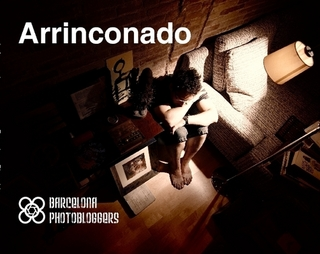

# Arrinconado

Arrinconado abre una nueva etapa para Barcelona Photobloggers. El objetivo fue crear un proyecto colaborativo donde
todos los miembros tuvieran la oportunidad de participar desde la definición hasta la producción con una organización
horizontal que da como resultado una obra de autoría grupal y no un conjunto de autores en el mismo espacio.

El camino que recorrieron durante este año y medio de trabajo supuso un reto, donde lo importante fue el proceso de
creación en sí mismo, la experiencia reflexiva, el intercambio de ideas y de metodologías.

Basada en el relato corto de Santiago Ambao, escogido por su calidad, su relación con la ciudad y la proximidad con el
autor, Arrinconado es una fotonovela con tres protagonistas: Ismael, Nuria y la ciudad de Barcelona.

Disponible como: [impresión bajo demanda](http://www.lulu.com/shop/barcelona-photobloggers/arrinconado/paperback/product-15571787.html), 
[ebook version](http://www.lulu.com/shop/barcelona-photobloggers/arrinconado-ebook-edition/ebook/product-18560631.html)
y vídeo [English](https://vimeo.com/31446721) and [Español](https://vimeo.com/22812002).