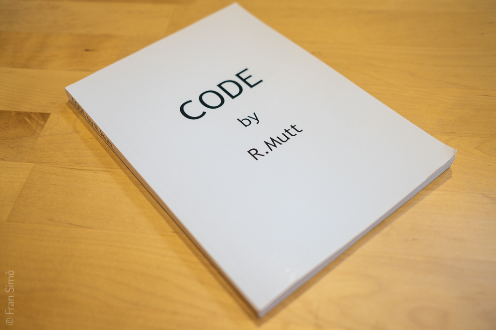
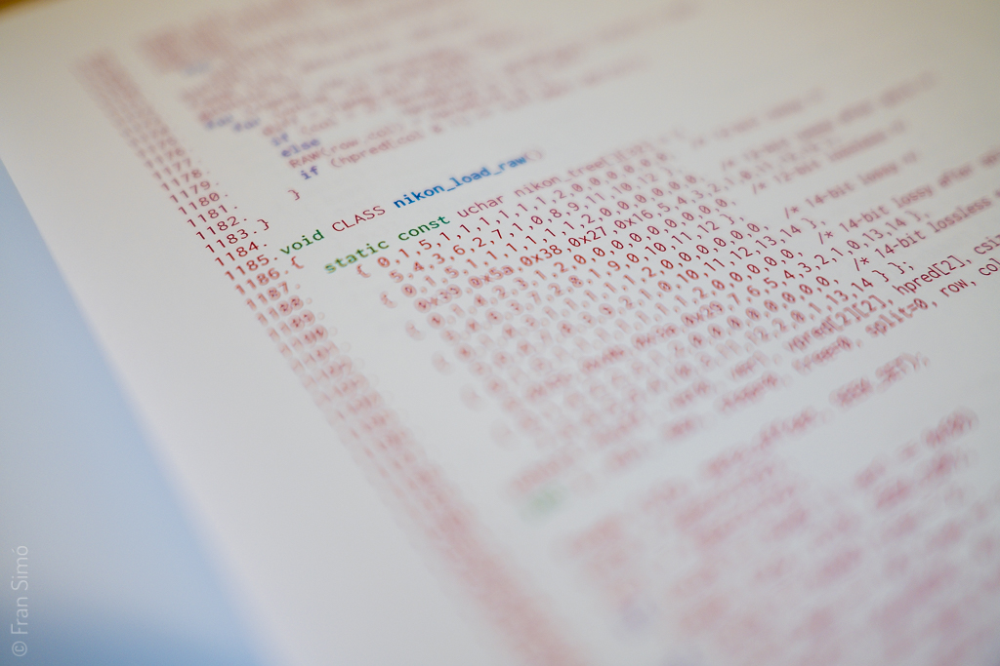

# CODE by R.Mutt

{}

2019

Color book.
164 Pages, A5.

Available on [Lulu](https://www.lulu.com/en/shop/fran-sim%C3%B3/code-by-rmutt/paperback/product-1wk5j69d.html?page=1&pageSize=4) and [Issue](https://issuu.com/fransimo/docs/code_by_mutt).

{}

(text by [Carlos Lozano](https://twitter.com/clozano80))

“Computers are bringing about a situation that’s like the invention of harmony. Subroutines are like chords. No one would think of keeping a chord to himself. You’d give it to anyone who wanted it. You’d welcome alterations of it. Subroutines are altered by a single punch. We’re getting music made by man himself, not just one man.”

John Cage (1969)

As early as the late 1960s, multidisciplinary artist John Cage alluded to the collaborative use that digital creations should be given, creations as a common good, although it was not until the early 1990s that the practice was coined as ‘Open Source’.

Code by R. Mutt is a readymade work derived from the open source application dcraw(1). This proposal is developed based on the Unix philosophy currently used for RAW image processing. Generally, digital camera manufacturers deliberately obfuscate the code used to capture snapshots, and it is thanks to the use of Creative Commons licenses that today we can make use of such media. By nature, certain resources are public and should not be owned by private individuals or the State, so the conflict over private and public property arises. In this context, artistic creation processes have always been understood as individual even though, in a subtle way, there’s always an underlying collaborative process. We can infer that intellectual activity has its origins in previous influences that, in many cases, may seem obvious to us, and not so clear in others. The current digital world does not have such clear boundaries as in the artistic tradition of the analog world; we live in an age where ‘copy- paste’ has been established as a new creative way to conceive, devise and construct. Digital art is the right raw material for collaboration, with the ability to produce a multitude of hybrid products. Products that are the result of work of many who contribute materials, tools, ideas or simply critique.

Thanks to Code by R. Mutt’s licenses, the artist breaks down the barriers that separate him from the observer. Along with the same authorship that the artist had while creating the work, the visitor or observer is given the opportunity to create their own new original. Visitors, therefore, not only view the work but can also participate in the creation process as co-authors. The concept of the work modifies the rules of intervention, thus evoking a number of questions related to authorship, claims and intertextuality, intellectual property and the public domain, poetic license and collective artistic production.

One could talk about an open-source poetics or a poetics based on the common good, on a decentralized and non-proprietary model of shared cultural codes and networks of dissemination and collaborative authorship. A literary appropriation is therefore used as a communal gesture that registers a common mastery of shared concepts, thus freeing the code from its fixed and static position, and allowing it to change in an environment of authorial, intertextual and communal networks. The book is a recontextualization within the Open Source poetic environment. Therefore, the possibility of changing the circumstances that surround or condition it is intensified, leading to the development of other visions or ideas, regardless of the actions of the original author. A totally open source allows structural and conceptual modification of the work. The redefined term of the original not only doesn’t strive for singularity, but also provokes and causes multiplications by its own use.

The concept of ‘readymade’ is based on the principles of uncreative writing. While creative writing demands originality, inspiration, and expression of subjectivity, uncreative writing is based on copying, methodology, and removing the author. A valid way to create literature is to try to suppress expressivity and use the techniques of reproduction and plagiarism, taking advantage of the hyperabundance of language generated by the contemporary world. The paradox that justifies this action is that the suppression of expressivity is impossible. It is therefore demonstrated that the recontextualization of the writings is a powerful way of generating new meanings and interpretations. (2)

The work would fall within the classification of Software Art as it results from a formal and autonomous creative practice that can critically refer to the technological, cultural or social meaning of the software. Thanks to its own medium, a critical reflection on the software and its cultural impact is allowed. Unlike the usual code, this code is not intended to generate autonomous works, since this code in itself is the work of art. It is also worth noting the performative force of the same code which is not enclosed only in its purely technical part. When the code is embodied in a physical book, it happens outside of a closed technical environment, that is, it happens within the field of the aesthetic, the political and the social. Code, as an act of rebellion and effective speech, is not a description or representation of something, rather, it’s a thing that directly and literally affects it by becoming action. This coded performativity has immediate consequences in the real and virtual spaces in which we move and live today. This ultimately means that such performativity mobilizes or immobilizes its users. (3)

“Code can be diaries, poetic, obscure, ironic or disruptive, defunct or impossible, it can simulate and disguise, it has rhetoric and style, it can be an attitude”.

Florian Cramer and Ulrike Gabriel.

## References

(1) Dave Coffin, (1997). Dcraw software. [https://es.wikipedia.org/wiki/Dcraw](https://es.wikipedia.org/wiki/Dcraw)

(2) Goldsmith, K. (2015). “Uncreative Writing: Managing Language in the Digital Age”. Buenos Aires: Black Box.

(3) Inke Arns. _Code as an Act of Performative Speech_ (2005).

## Motivation

I was always fascinated by this piece of code that literally was responsible of _developing_ all digital pictures in the open source space. Being a software developer, its simplicity was very attractive to me. Just one file holds everything. It is beauty in code. For me, it was already art but [I wanted to transform it into an object, an artwork](https://www.lulu.com/en/shop/fran-sim%C3%B3/code-by-rmutt/paperback/product-1wk5j69d.html?page=1&pageSize=4).

CODE was part of [function(“innocence”, 2019)](https://fransimo.info/blog/2019/05/26/functioninnocence-2019/) festival. It [is open source too](https://github.com/r-mutt-1917/CODE).

The motivation was also to question the artist’s relationship with the open source community. Almost all artists are using open source but few are sharing back their code.



Browse the code [on](https://issue.com/fransimo/docs/code_by_mutt) [issuu](https://issuu.com/fransimo/docs/code_by_mutt) or [download it](CODE_by_Mutt.pdf).

