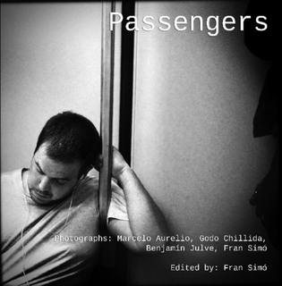

# Passengers

Passengers es un proyecto de fotografía callejera, tanto en formato web como en serie de libros, sobre pasajeros
anónimos del transporte público. Está diseñado como un proyecto participativo en línea. Todas las imágenes son
capturadas con dispositivos móviles y publicadas en Instagram. El sitio web ofrece una “vista en tiempo real” del
proceso de participación. El libro es una meditación visual sobre los pasajeros del transporte público y la estética de
la fotografía callejera utilizando dispositivos móviles.

En el libro contribuyo con el texto [De la Kodak Brownie al iPhone](From_the_Kodak_Brownie_to_the_iPhone)

Está disponible en formato impreso y en varios formatos de libro electrónico:

<ul>
<li>PDF de descarga gratuita: <a href="http://passengers-streetphotography.com/wp-content/uploads/2011/12/Passengers_v4_1_6_full_es_PDF.pdf">9 Megas</a></li>
<li>eBook para <a href="http://passengers-streetphotography.com/wp-content/uploads/2011/12/Passengers_es.epub">Apple</a>, <a href="http://passengers-streetphotography.com/wp-content/uploads/2011/12/Passengers_es.mobi">Kindle</a>, <a href="http://passengers-streetphotography.com/wp-content/uploads/2011/12/Passengers_es.epub">Nook</a>.</li>
<li><strong>Tapa blanda <a href="https://www.lulu.com/shop/benjam%C3%ADn-julve-and-godo-chillida-and-marcelo-aurelio-and-fran-sim%C3%B3/passengers/paperback/product-16qngr7g.html?q=Passengers&page=1&pageSize=4">impresión Lulu.com</a></strong></li>
<li>Tapa dura <a href="http://es.blurb.com/bookstore/detail/2995514">impresión en Blurb</a> (pendiente de revisión)</li>
</ul>
