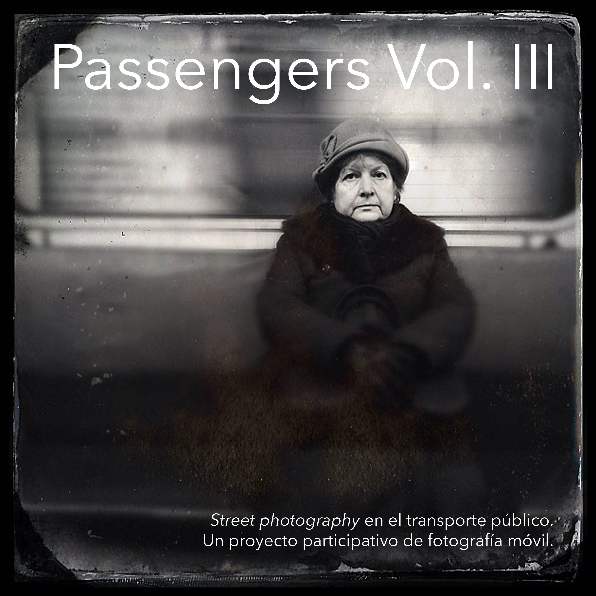

{}

<--->
# Passengers Vol. III

*Passengers Vol. III* concludes the trilogy with photographs taken between 2013 and 2015. The book features 42 images by 12 authors, selected from an initial pool of 7,515 images by 71 photographers. The first selection round took over a year. Editors could vote to accept an image as part of the new book through an individual online process. After so much selection work, we weren’t sure if we could create another book with a cohesive thread… until we saw the images chosen by the four editors together. It was a surprise to find coherence among those seven thousand photos and between the four of us. The second, third, and fourth rounds of editing were done in person, working with around 300 printed photographs.  

{}

Through the trilogy, we can see how mobile aesthetics evolve, how devices become part of daily life, how cameras capture more, how photographers change their distances, and how editors grow older in @passengers' photos. ;-)  

*Passengers* has been a project that has taken us through many stations over nine years. It has helped us bridge distances with our fellow photographers in many countries, and we hope it serves to bring a deeper understanding of how city dwellers have lived the beginning of the century.

Available at [Lulu](https://www.lulu.com/es/shop/fran-sim%C3%B3-and-benjam%C3%ADn-julve-and-godo-chillida-and-marcelo-aurelio/passengers-vol-iii/paperback/product-1y884p24.html?page=1&pageSize=4).

