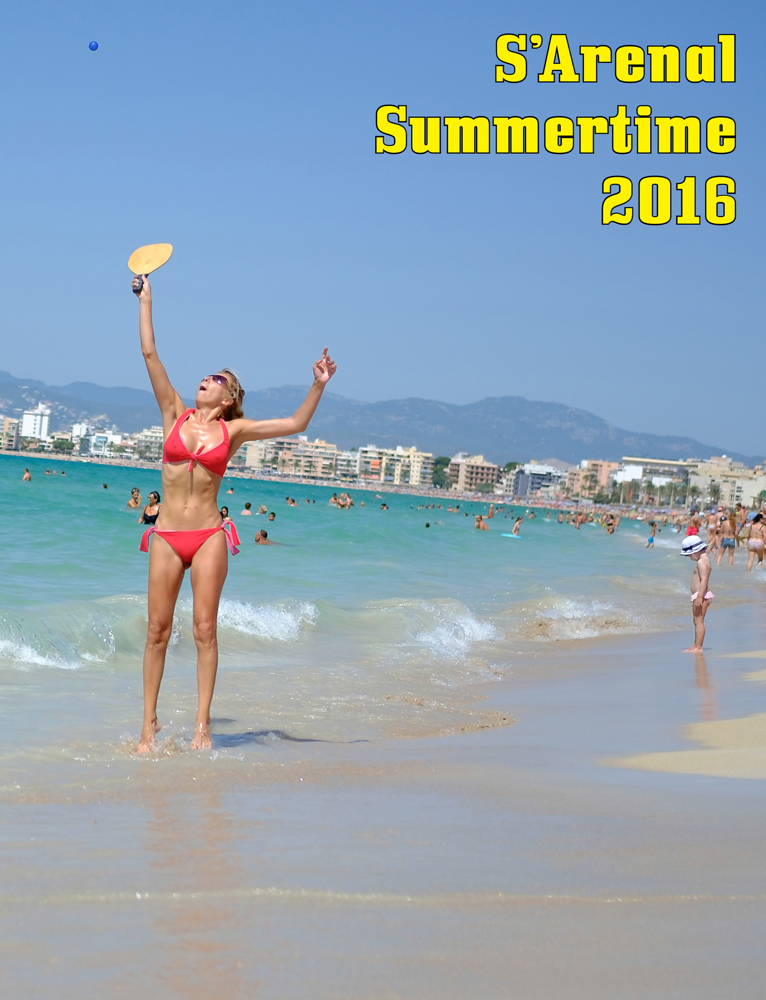

{}

<--->
````
2016-2017  
Revista, 36 páginas, 22×28 cm (Letter)
````

-   Edición limitada de 50 ejemplares, numeradas y firmadas con motivo de la exposición [Ciutat de Vacances](http://www.esbaluard.org/es/exposicions/159/ciutat-de-vacances-stand-de-turismo-en-el-palacio-grimani-venecia). Papel de 130 gramos y portada de 170 gramos encuadernación grapada. Disponible en la tienda del [Museo Es Baluard](http://www.esbaluard.org/) o a petición en [contact@fransimo.info](mailto:contact@fransimo.info).
-   Edición de impresión bajo demanda. Papel mate 118 gramos y portada semibrillante de 216 gramos, encuadernación rústica. [Disponible para compra on line](http://www.blurb.com/b/7844486-s-arenal-summertime-2016).
-   Edición digital está disponible para: [Apple iBooks](http://itunes.apple.com/us/book/id1223132726), [Amazon Kindle](http://amzn.to/2o2O2JN) [(free)](S_Arenal_Summertime_2016_v2.mobi), [Issue](https://issuu.com/fransimo/docs/s_arenal_summertime_pdf_on_line) y [PDF](S_Arenal_Summertime_2016.pdf)

{}

_«...el aspecto fundamental que me interesaba explorar constantemente es la diferencia entre la mitología de un lugar y su realidad»_ ([Martin Parr por Martin Parr, La Fábrica, 2010](http://amzn.to/2omVlfK))

Cuando Parr habla de la mitología de un lugar lo relaciono inmediatamente a postales, catálogos turísticos y vídeos promocionales. Pero el mito del turismo va más allá de la construcción de un ícono dirigido al consumidor.

Nací en [Villa Carlos Paz](https://es.wikipedia.org/wiki/Villa_Carlos_Paz), Argentina, autodenominada “ciudad turística”. En 1998, a mis 25 años, emigré a Barcelona, al barrio Sagrada Familia. En 2014 me trasladé a Palma de Mallorca. La industria del turismo ha sido una constante en mi vida.

Mis estacionalidades se relacionan con las temporadas turísticas, no con las cosechas. El verano, el sol, la playa, el olor a protector solar, la piel descamada, la visión sobrepasada de luz, el sonido del agua, las olas y los niños jugando en la playa nunca han sido algo que tuviera que ir a buscar a un destino, los tenía en casa. Siempre he tenido una playa a menos de un kilometro de mi lugar de residencia.

Desde esta perspectiva el turismo siempre ha sido: los que vienen y los que estamos. Ambos compartimos el mismo espacio, a veces, con el mismo rol lúdico.

Los que vienen siguen al mito, en el ritual de las vacaciones, pieza clave de la religión capitalista. Sea para eludirse, para leer, jugar, reunirse con la familia o amigos, un destino de sol y playa es el mito por excelencia de la industria.

Los que estamos, nos mezclamos con los turistas en el mito del destino en algún momento. Pero nuestra ilusión tiene otras dimensiones. Para los que estamos o los que han venido para quedarse, la promesa de trabajo y progreso se convierte en la transformación del paisaje, las aglomeraciones, la inmigración, los jornaleros, los empresarios improvisados que llegan al destino para ganar dinero rápido…

La industria turística crea un mito pero no solo para el consumidor. Casi toda mi vida me he ganado el sustento directa o indirectamente con el turismo. Creo que el turismo es esencialmente algo bueno, me encanta recibir turistas y ser turista. Pero muchos habitantes de destinos no acaban de integrarse y más que disfrutar del intercambio sufren una invasión. Esta diferencia es consecuencia de la falta de sensibilidad de los agentes de la industria y todos los que estamos involucrados deberíamos tenerla en cuenta para garantizar la sostenibilidad.



## Proceso

Las fotografías de _S’Arenal Summertime 2016_ han sido tomadas en 11 sesiones entre el 2 de julio y el 18 de septiembre del 2016, entre las 11:00 y las 14:00. Generalmente en fines de semana, caminando casi sin detenerme, casi en linea recta, partiendo de la calle Amilcar en dirección a Can Pastilla, con el sol en la espalda.

Esto configura tres imágenes tipo:

-   Con la vista hacia adelante, la imagen se parte en dos: en el horizonte la ciudad, por encima el cielo, por debajo el mar hace un triángulo que sugiere una flecha apuntando hacia la derecha que se completa con el triángulo de la arena.
-   Con vista a la izquierda, la típica visión de arena, mar, cielo.
-   Con vista a la derecha, encontramos los retratos de la gente que descansa en la arena con la ciudad, los hoteles de fondo.

La captura de la imagen es digital. En el revelado utilizo la simulación de película Fuji Velvia, tradicionalmente utilizada por los fotógrafos de naturaleza y viajes para catálogos y revistas. Fuji diseñó la paleta de color de Velvia partiendo el concepto de [«Color memorizado»](http://fujifilm-x.com/es/x-stories/the-world-of-film-simulation-episode-3/) y continuó la investigación hacia la representación de un recuerdo basándose en preguntas como «¿Qué colores permanecen más presentes en la memoria?» alejándose de una representación exacta para buscar la evocación de un recuerdo no lejano o pasado, sino del tipo «como si estuviera ahí ahora».

La versión electrónica no es solo un formato extra de distribución, la elección de las pantallas como medio expositivo permite que la imágenes representen el color y la luz. Para mí, una de las principales sensaciones de la playa es la intensidad lumínica. El papel se adapta bien al concepto de revista de viajes o catálogo turístico, las pantallas refuerzan la potencia del sol.

El proceso creativo de _S’Arenal Summertime 2016_ integra y continúa trabajos anteriores. Mi primer trabajo sobre playas «Sant Sebastiá, Barceloneta, 2009-2013» combinado con todos los relacionados con fotografía intuitiva, deriva y geo-posición, selección automática(sin pensar), publicación inmediata en redes y por supuesto la fotografía de calle.

Durante las caminatas, las fotografías se tomaban sin pensar, a veces, sin encuadrar. Durante el viaje de regreso, en transporte público, se hacía una primera selección con una visualización de apenas segundos. Sin haber llegado a casa un grupo de las imágenes se publicaban en las redes sociales. La interacción del público con comentarios (en las mismas redes o personales) ayudan en el proceso de comprensión del tema.

Luego todo el archivo queda congelado durante algunos meses a partir de los cuales comienza una re-lectura de todo el material en varias vueltas. Las tres primeras vueltas descartan el 90% de las imágenes. El 10% restante pasa por varias selecciones basadas en agrupaciones, temática y posibilidades técnicas.

Con ese 10% se trabaja el formato final y cuando se trata de publicaciones se hacen varias pruebas con distintos proveedores, papeles, etc., etc.