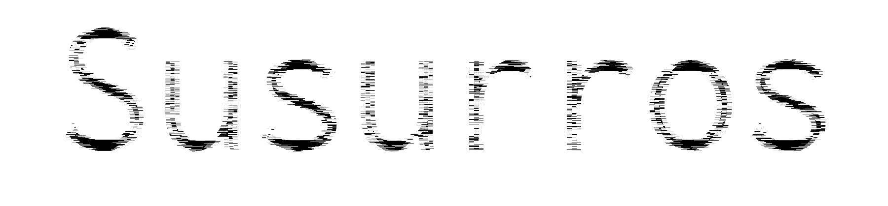

# Susurros (Whispers)

{}

2019

Fanzine
20 Pages, A5.

{}

Open source subtitle editing for the movie Ghost in the Shell: Innocence.

The concept of ‘readymade’ is based on the principles of uncreative writing. While creative writing demands originality,
inspiration, and expression of subjectivity, uncreative writing is based on copying, methodology, and removing the
author. A valid way to create literature is to try to suppress expressivity and use the techniques of reproduction and
plagiarism, taking advantage of the hyperabundance of language generated by the contemporary world. The paradox that
justifies this action is that the suppression of expressivity is impossible. It is therefore demonstrated that the
recontextualization of the writings is a powerful way of generating new meanings and interpretations. (2)

(Goldsmith, K. (2015))

