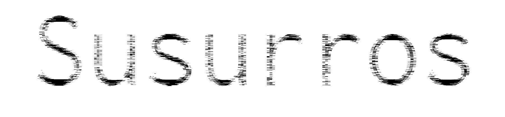

# Susurros

{}

2019

Fanzine
20 Páginas, A5.

{}

Edición de los subtítulos con licencia open source de la película Ghost in the Shell: Innocence.

El readymade está fundamentado en los principios de la escritura no-creativa. Si bien la escritura creativa demanda
originalidad, inspiración y expresión de la subjetividad, la escritura no-creativa se basa en la copia, el método y la
eliminación del autor. Una forma válida de crear literatura consiste en intentar suprimir la expresividad y utilizar las
técnicas de la reproducción y el plagio, aprovechando la hiperabundancia de lenguaje que genera el mundo contemporáneo.
La paradoja que justifica este accionar es que la supresión de la expresividad es imposible.
(Goldsmith, K. (2015))

