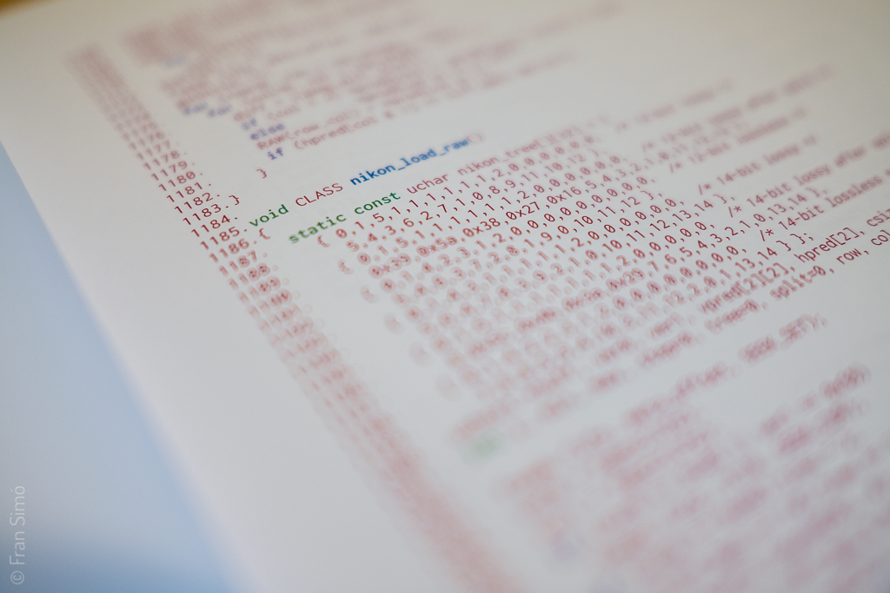
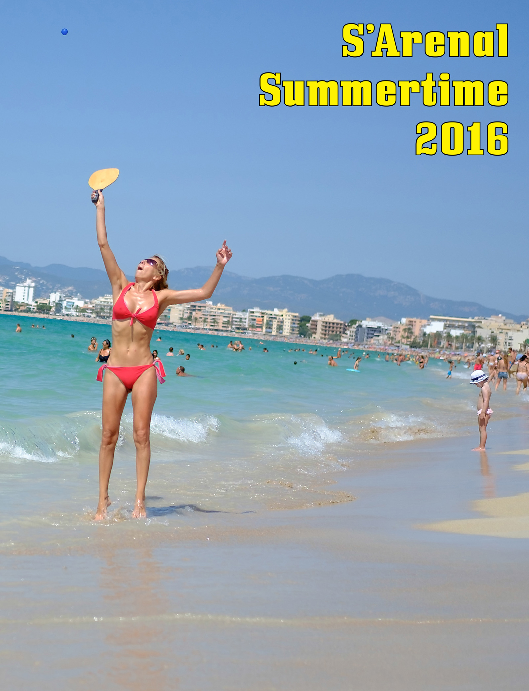
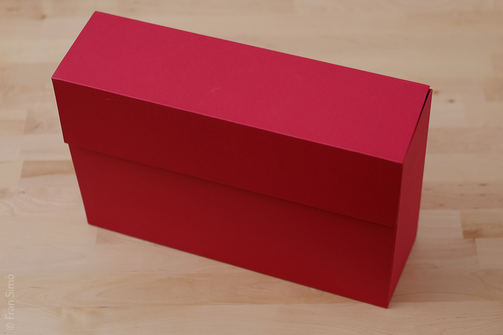
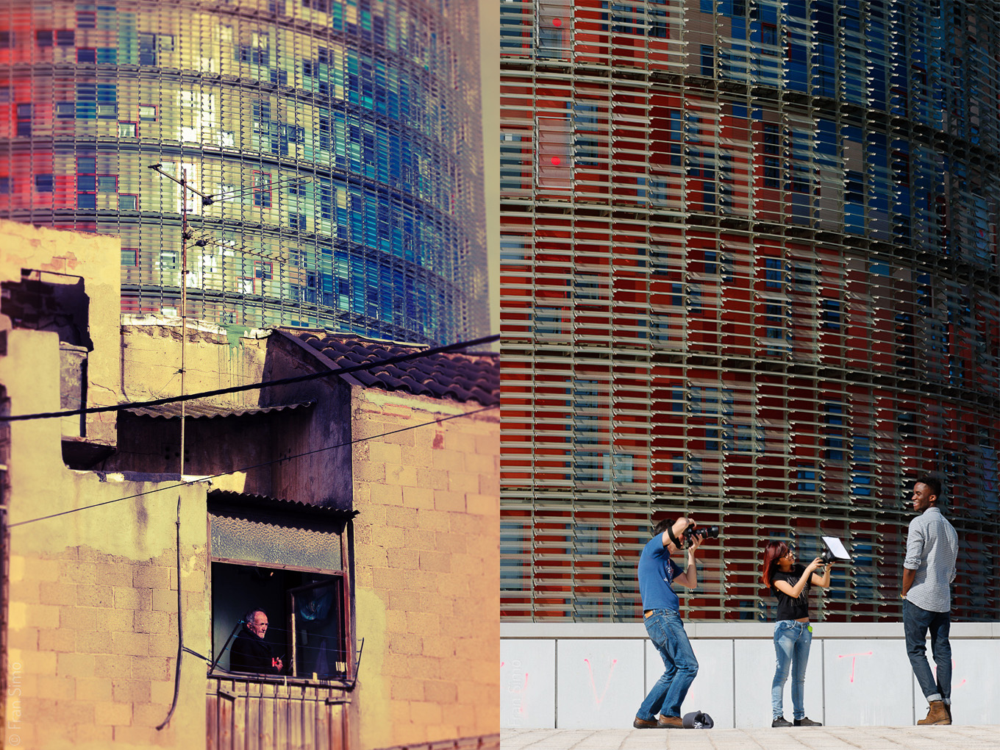
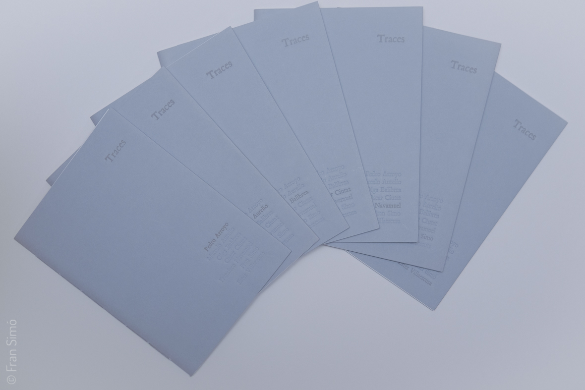
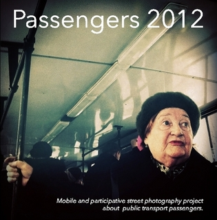
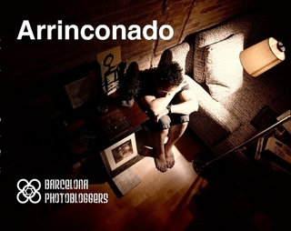
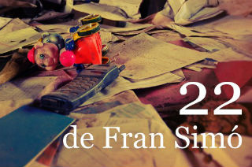

## CODE

 
<--->
[CODE]((/blog/2019/05/29/code-by-r-mutt/)) is a readymade artwork derived from [dcraw.c, Dave Coffin’s raw photo decoder](https://www.dechifro.org/dcraw/). 

Available on [Lulu](https://www.lulu.com/en/shop/fran-sim%C3%B3/code-by-rmutt/paperback/product-1wk5j69d.html?page=1&pageSize=4) and [Issue](https://issuu.com/fransimo/docs/code_by_mutt).


## S’Arenal Summertime 2016


<--->
S’Arenal Summertime 2016 is a photo essay about the life on the beach in S’Arenal, Palma, Majorca, Spain.

“…the fundamental thing I am constantly exploring is the difference between the mythology of a place and the reality of it.” (Martin Parr)

The tourism industry creates a myth but not just for the consumer. Almost all my life I have made a living directly or indirectly through tourism. I think that tourism is essentially a good thing. But many inhabitants of destinations do not manage to integrate and rather than enjoy the exchange suffer from the invasion. This difference is a consequence of the lack of sensitivity on the part of the industry’s agents and all of us who are involved should take it into account to guarantee sustainability.


## Shared Folder 


[Shared Folder Dummy](/blog/2016/05/07/shared-folder-dummy/)
<--->
Found photography was about photos that were never intended to be public. Their authors didn’t publish them. They had been kept in boxes for years.

I asked myself: Where can I find these images in the context of the digital era?

Shared folder shows what I’ve discovered.


## 22.2


<--->
[22.2](/blog/2015/04/23/22-2/) is the second version of [22](/blog/2010/01/14/22/). It compares the original photographs, taken between 2000 and 2009, with new shots of June 2014.

[22](/blog/2010/01/14/22/) and [22.2](/blog/2015/04/23/22-2/) portray the transformation of Poblenou from the post-industrial oblivion toward the “new” Barcelona.

It’s an edition of 100 signed fanzines of 24 pages is 19×13,4cm printed en matt coated paper of 170gr.

Book video at [vimeo](https://vimeo.com/130670327).


## Traces


<--->
[Traces](/blog/2014/05/02/traces-2013-12-07-barcelona/) is a collective project that provides a chance to experience a dérive and verify its capacity to document urban space from different perspectives while using a common methodology and creating a psychogeographical map of Barcelona.

Traces is a series of photography books and an exhibition. The exhibition took place at the Galería Tagomago, from May 8th to June 14th, 2014. Carrer Santa Teresa 6, 08012 Barcelona

The following photographers participated in the project: Pedro Arroyo, Marcelo Aurelio, Olga Balibrea, Oscar Ciutat, Francisco Navamuel, Fran Simó and Ester Villaescusa.


## Passengers 2012


<--->
[Passengers 2012](/blog/2013/11/16/passengers-2012/) is the second book of Passengers series.The books contain short essays about the “state of art” and its relationship to society, history, the individual, and the creative processes used in Passengers.

This installment consists of 105 images by 36 authors from 25 cities. We have received photographs from Brazil, Russia, the United States, Japan, France, Spain, Turkey, Chile, Sweden, China, Venezuela, Italy, Germany, Switzerland, Holland, Hungary, Serbia, Bulgaria, England, Czech Republic, Honduras, Hong Kong and Guatemala: 23 countries in total.

It’s available in printed and various ebook formats [here](http://passengers-streetphotography.com/eds/).

[Browse PDF in full screen](http://issuu.com/fransimo/docs/en_passengers_2012-e?e=2922899/5647796)


## Passengers


<--->
[Passengers](http://passengers-streetphotography.com/eds/) is a street photography project, in both web and book series form, about anonymous public transport passengers. It’s designed as a participative online project. All the images are captured by mobile devices and published on Instagram. The site is a “real-time view” of the participation process. The book is a visual meditation on public transport passengers and the aesthetics of street photography using mobile devices.It’s available in printed and various ebook formats [here](http://passengers-streetphotography.com/eds/).

[Browse PDF in full screen](http://issuu.com/fransimo/docs/passaengers_v4_1_4_full_en_pdf?e=2922899/3360814)


## Arrinconado (Cornered)


<--->
Project [“Arrinconado” (Cornered)](http://arrinconado.barcelonaphotobloggers.org/) starts a new era for Barcelona Photobloggers. The objective was to create a collaborative project with a horizontal organization in which all of the members would have an opportunity to participate in every aspect of creation, from definition to production, and which would lead to a work authored by the group and not by a gathering of various authors in the same space.The path traveled during the year and a half of work presented a challenge, the most important part of which was the creative process itself, as well as the reflective experience and the exchange of ideas and methodologies.

Based on the short story by Santiago Ambao, chosen for its quality, its relationship to the city and the authors’ close relationship with the group, “Cornered” is a photo- novel with three main actors: Ismael, Nuria and the city of Barcelona.

It’s available in [printed version](http://www.lulu.com/shop/barcelona-photobloggers/arrinconado/paperback/product-15571787.html), [ebook version](http://www.lulu.com/shop/barcelona-photobloggers/arrinconado-ebook-edition/ebook/product-18560631.html) and video version in [English](https://vimeo.com/31446721) and [Spanish](https://vimeo.com/22812002).


## 22


<--->
[22](/blog/2010/01/14/22/)’s pictures are fragments of calm between two ages, two development models: the industrial model and the knowledge model.Poblenou neighborhood in Barcelona suffered the industrial crisis and remained forgotten. It was later conquered by homeless immigrants, squatters, ruins, demolishers, gypsies, abandoned toys, old account books… and the resistance, people who already lived there before changes began and never wanted to leave.

This selection of 22 pictures comes from my personal file of about 2000 pictures of the area taken between 2000 and 2009. It’s more emotional than documental.

It’s available in a limited printed edition and ebook in [English](http://www.lulu.com/shop/fran-sim%C3%B3/22/ebook/product-20663836.html) and [Spanish](http://www.lulu.com/shop/fran-sim%C3%B3/22/ebook/product-18680983.html).

Book video at [vimeo](https://vimeo.com/130667877).

