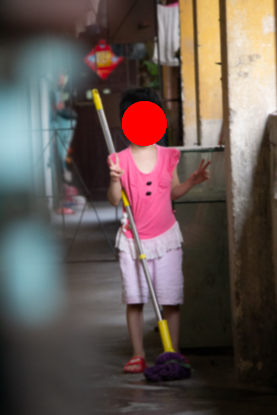
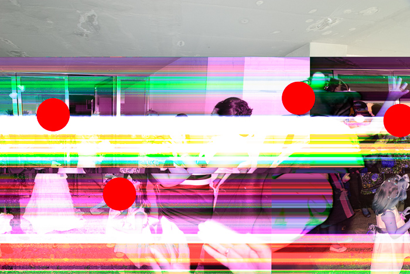
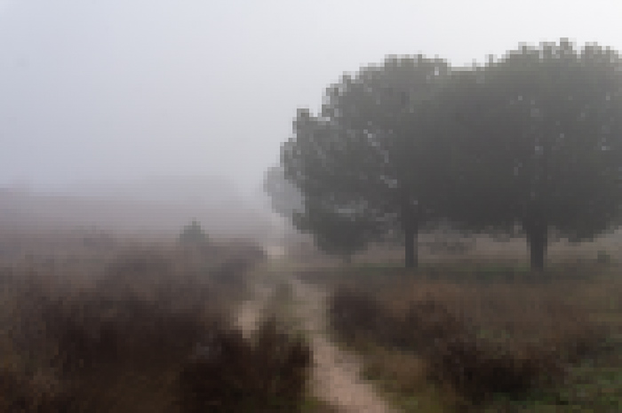
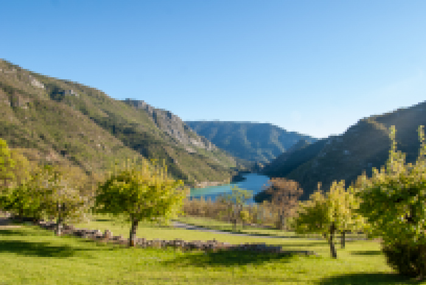
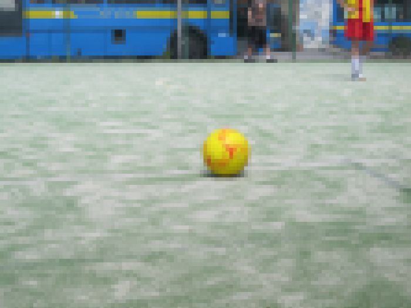
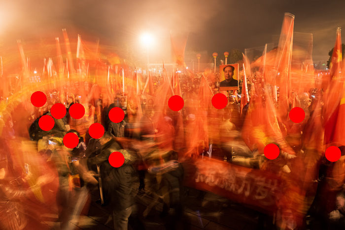

 
# Shared Folder (Red box) v'21

POI Finch: _“You are being watched. The government has a secret system: a machine that spies on you every hour of every day. I know, because I built it… “_ …maybe the government doesn’t need the machine… **you are sharing your intimacy without even knowing and anyone can access it with a 35$ machine**.

Back in 2015 I asked myself: what could found photography be like in the digital age? I created [_Shared Folder (Red Box)_ in 2016](https://fransimo.info/blog/2016/05/07/shared-folder-red-box/).

Since the motivation was a purely theoretical one, what I found was very concerning.

This [collection](https://bit.ly/3eVNPlm) consists of a series of aesthetically eye-catching images that may help direct our mind towards questioning privacy in today’s network life.

_Red Box_ was part of the Function Festival where I did a performance. I was there in a dark room with a box showing it to groups of people. I was telling the story of Celine: a girl from Paris, daughter of Vietnamese immigrants. I knew where she lived, her school, her friends’ faces, I even showed a picture of her grandma’s ID (all faces and personal details were hidden).

A woman from the audience was very angry. She believed I was downloading the nude pictures of her son she used to take with her phone. I tried to explain to her that I was downloading pictures that were somehow published on the web by mistake. A place where anyone can search and download. After the first moments of tension she asked me: “How can I know if I’m publishing without knowing?” I reached my goal: she was starting to ask the right questions.

I grabbed the images from a peer to peer network commonly used to download movies. People use the network to download but they also share their personal files. I’m not sure if they do it by mistake or because they want to send the files to their relatives or friends. The fact is that the files are there and anybody can download them. I wasn’t hacking/breaking anything. It’s as easy as doing a search for a file with a common name like “CV.DOC”

My objective with _Shared Folder_ is to show you that once a file is created, it can be copied, and in our era of very-connected devices, you should know what you are sharing.The project is an intersection of found photography, cybersecurity, art and NFTs.

## Shared Folder (Red box) 2021 edition

With the momentum of NFTs I hope this project may go viral and more and more people realize the importance of understanding technology. In that sense, the incredible prices are used to attract attention. There are other initiatives that are headed in the same direction. I hope mine helps the others with an aesthetics component.

The 2016 edition is a physical edition (of 2). The public has access to photographs that are covered with red dots. In that way I invite the public to decide if they will infringe on the intimacy by removing the red dots or just let them cover their faces.

In the 2021 edition, all files have the same red dot and/or a pixelation but it can be removed or undone. If the viewers want to check the original photo, the only option is to search the file name in the [emule](https://www.emule-project.net/home/perl/general.cgi?l=1) network.

You can find the NFTs in this OpenSea collection: [https://opensea.io/collection/shared-folder-red-box](https://bit.ly/3eVNPlm)

## How can you protect yourself?

For this project I used the [emule network (ed2k)](https://en.wikipedia.org/wiki/EDonkey_network). If you have [emule](https://www.emule-project.net/home/perl/general.cgi?l=1) installed just check which folders you are sharing.

As for the phones, you should check if you are using cloud backups. If you are, please use a strong password and change it from time to time. If you have several accounts with sensitive data, don’t use the same password for all the services.

Back to film… don’t worry, somebody will find it. And they might get rich selling your photos. The difference is that you will probably be dead by that time.

## How can I do it myself?

Since it’s not my intention for people to start downloading the private lives of others, I always share my code.

You can see how I made it in this [github repository](https://github.com/fransimo/shared_folder).

If you want to keep it simple just download emule and search for “IMG\_0001, IMG\_0002, IMG\_0003…”

## A word about “classic” found photography

[Wikipedia](https://en.wikipedia.org/wiki/Found_photography): “**_Found photography_** _is a genre of photography and/or visual art based on the recovery (and possible exhibition) of lost, unclaimed, or discarded photographs._

_It is related to_ [_vernacular photography_](https://en.wikipedia.org/wiki/Vernacular_photography)_, but differs in the fact that the “presenter” or exhibitor of the photographs did not “shoot” the photograph itself, does not know anything about the photographer, and generally does not know anything about the subject(s) of the photographs._

_Found photos are generally acquired at_ [_flea markets_](https://en.wikipedia.org/wiki/Flea_market)_,_ [_thrift_](https://en.wikipedia.org/wiki/Charity_shop) _and other_ [_secondhand stores_](https://en.wikipedia.org/wiki/Second-hand_shop)_,_ [_yard sales_](https://en.wikipedia.org/wiki/Garage_sale)_,_ [_estate_](https://en.wikipedia.org/wiki/Estate_sale) _and_ [_tag sales_](https://en.wikipedia.org/wiki/Tag_sale)_, in_ [_dumpsters_](https://en.wikipedia.org/wiki/Dumpster) _and trash cans, between the pages of books, or literally just “found” anywhere._”

There are a lot of works about found photography. One of the most amazing cases of found photography is [Vivian Maier](http://www.vivianmaier.com/)’s. She took the photographs but she didn’t print them and she never showed them. She wanted to keep them private but just after her death, one of her lockers was bought by John Maloof in an auction. Her photography is as good as any of the masters of her time and she didn’t get any money in her lifetime. 

Another shocking case I found through the years is Günter K. He took photographs and kept all kinds of records of his mistress, Margaret. The materials was found and eventually became part of a Bruno Decharme’s collection which was shown in Arles in 2019. Records include the occasion when she took contraceptive pills, erotic photography and all sort of private information.

Coming to this century two artists I would like to recommend are [Erik Kessels](https://www.erikkessels.com/) and [Joachim Schmid](https://www.lumpenfotografie.de/). They both work on found photography and the Internet. 

If you want more you can check this links:

-   Amazon book list: [https://amzn.to/2VV4WYF](https://amzn.to/2VV4WYF)
-   [https://foundphotography.nl/bibliografie/](https://foundphotography.nl/bibliografie/)
-   [Flickr Found Photo Group](https://www.flickr.com/groups/1459463@N25/)

I hope all this material makes you think. That’s my goal.

## Gallery

 

  

 

 

