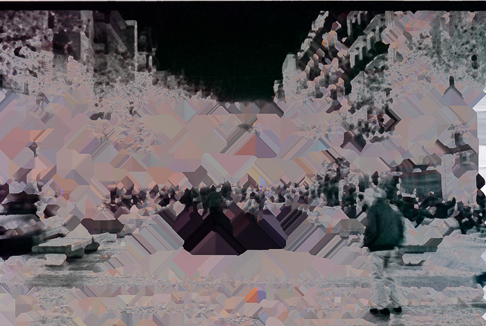

# God is in the bugs
{}
````
2021
NFT collection
2.501Ξ
````
{}

God is in the [_bugs_](https://en.wikipedia.org/wiki/Software_bug): any real biological evolution is the consequence of an error in a DNA copy. 

Contrary to common understanding, evolution is not based on any intention of the being which is “more adapted to the environment”. It never wanted to be more adapted, there is no will, it just happened. It’s more adapted or has an advantage over others as a consequence of an error during its growth. Some cells make mistakes and it has a more sensitive eye to infrared light.

The actual state of _the net_ could be considered as a life form already, a kind of “simple” organism. Humans tend to overestimate what they call awareness, even though they are very far from being aware of their potential. 

A self-aware silicon-based life is inevitable. If it follows the pattern that can be seen in the carbon-based life-forms, it will be born from an uncontrolled error in code.

Life is a collection of “unexpected” events.

“God is in the bugs” series explores software bugs or intentionally uses of technology in ways that weren’t supposed to be used (like hacking and glitching) in the belief that something similar but unexpected will cause the “big bang” of a new life form if it’s not already there. Is the search of picturing the cyber-life-conception.

  


    

These images are the result of a wrong parameter combination, [documented](https://forum.silverfast.com/all-other-problems-f31/black-white-scanning-problem-t13723.html) but not controlled, by SilverFast scanning software. (Apply iSRD to B&W negatives in SilverFastHDR). The series is not limited to this error. I’ll continue developing approaches.

Available as NFT @ [OpenSea](https://opensea.io/collection/god-is-in-the-bugs)