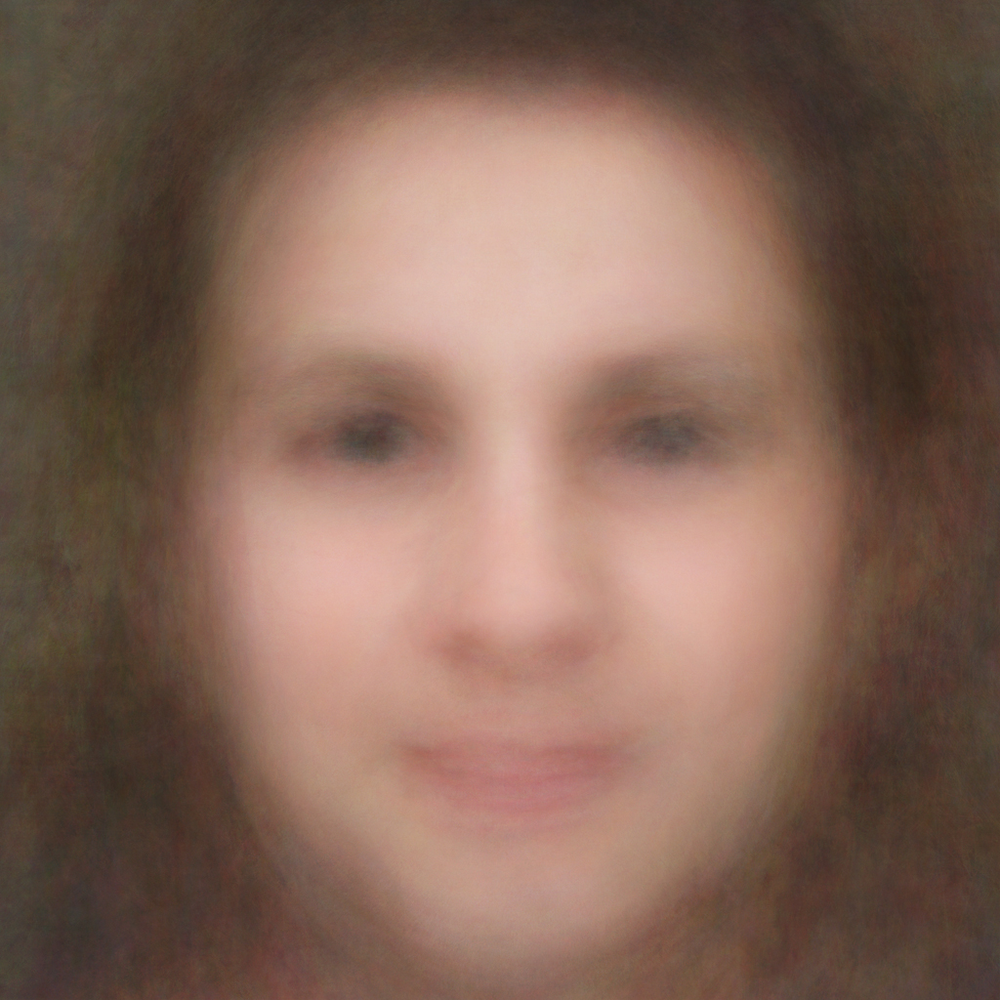
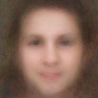
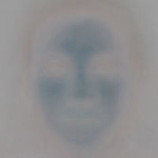
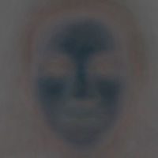
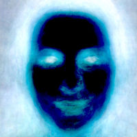
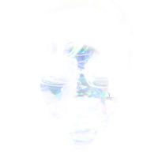
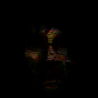

# He soñado con un ser humano

¿Cómo imaginaría un robot un rostro humano? “I dreamed about a human being” es como espiar dentro del cerebro de un robot.“I dreamed about a human being” es parte de un proyecto que explora el uso de la inteligencia artificial aplicada a la fotografía utilizando código y datos abiertos en Internet. El proyecto ya tiene una base de datos de 56 millones de imágenes. Tenemos herramientas increíbles y bases de datos de imágenes gigantescas de acceso gratuito pero no terminamos de entender qué podemos hacer con ellas o qué significa que estén ahí.

IDAAHB nos cuestiona sobre identidad, privacidad, el incrementó del poder computacional y el libre acceso a poderosos algoritmos matemáticos. Todo con un sentido estético y educacional.

Esta primera serie de imágenes son el resultado de cálculos estadísticos sobre 257 rostros detectados por un algoritmo que aprende a reconocer retratos con una estética específica. La búsqueda se realizó sobre 5 millones de imágenes publicadas en Flickr con licencias creative commons. “Mean”, la imagen de la derecha, es el promedio de esas 257 fotografías. Está compuesta por 17 bebes, 106 hombres, 79 mujeres, 18 niñas, 23 niños y 14 errores.

Otra manera de percibir esta acumulación de imágenes es pasar las imágenes a toda velocidad desenfocando un poco la vista. Se puede apreciar el mismo “efecto promedio” mirando el siguiente vídeo, que tiene 2582 imágenes pasando a una velocidad de 25 por segundo <a href="http://vimeo.com/49552899">http://vimeo.com/49552899</a>

<strong>Actualización 14/2/2013</strong>: También podéis ver las "hojas de contacto" aquí <a title="Mugs from the cloud" href="http://cloudmugshots.fransimo.info/">http://cloudmugshots.fransimo.info/</a>

<strong>Actualización 6/8/2013</strong>: La base de datos ya contiene 75 millones de imágenes y ha reconocido 345,625 caras.

<strong>Actualización 25/1/2015</strong>: a base de datos ya contiene 88 millones de imágenes y ha reconocido 1,250,415 caras.

## El algoritmo

El algoritmo utilizado para reconocer los rostros es capaz de encontrar cualquier objeto dentro de una fotografía pero para ello hay que enseñarle qué buscamos con imágenes similares.

Cuando comencé el proyecto no me interesaba encontrar caras sino retratos con una estética definida. El primer paso fue reunir una colección de retratos que siguieran esa estética para que el algoritmo comenzara a aprender.

La composición utilizada para entrenar al algoritmo es un conjunto de rostros frontales con iluminación regular, ojos debajo de los puntos de intersección superiores de la regla de tercios y la boca en el tercio medio inferior. Retratos similares a los de las fotos carnet o los “mug shots”, los retratos de los acusados de crímenes. El objetivo era enseñar al algoritmo a encontrar retratos dentro de las fotografías.

Dicho con otras palabras, el algoritmo re-encuadra una fotografía para convertirla en un retrato tipo foto carnet. Es posible que en la fotografía no haya rostros o que estos no cumplan con la estética deseada entonces es ignorada.

Debajo podemos ver un ejemplo del algoritmo funcionando. Una foto de una persona con un paisaje de fondo. El algoritmo reconoce la cara y la encuadra. Vemos como lo ojos tienden a estar en las líneas centrales de los tercios y la boca queda en el tercio medio inferior.



El aprendizaje del algoritmo es supervisado. Le enseñas, aprende y lo evalúas hasta que el resultado es satisfactorio. En cada iteración se agregan rostros y se le explican los errores que ha cometido.

Como parte de la evaluación necesitaba ver el conjunto de imágenes descrito estadísticamente por su promedio, mediana, máximo y mínimo. Así encontré “I dreamed about a human being”. Al ver las imágenes pensé ¿sería así como nos imaginaría un robot?

<table>
<tbody>
<tr>
<td></td>
<td></td>
<td></td>
<td></td>
<td></td>
<td></td>
</tr>
<tr align="center">
<td>Mediana</td>
<td>Desviación estándar</td>
<td>Varianza</td>
<td>Asimetría</td>
<td>Rango</td>
<td>Mínimo</td>
</tr>
</tbody>
</table>

Hoy damos por sentado que las cámaras, los teléfonos, nuestro software de fotografías e incluso Facebook puedan reconocer las caras. Para la mayoría esto es “magia”. No solamente nadie sabe cómo lo hacen sino que nadie se pregunta cómo lo hacen o qué más pueden hacer.

Lo más fascinante del tema para mi es la pregunta ¿qué más pueden aprender? ¿qué les podemos enseñar a ver? Las aplicaciones típicas de estas tecnologías siempre han sido la seguridad. Las aplicaciones comerciales están poco desarrolladas. Por ejemplo, hacer que un banco de imágenes se catalogue automáticamente. Algoritmos similares se utilizan para el diagnóstico por imagen. Pero ¿para qué la pueden utilizar los artistas o los filósofos?

## Fotografía e inteligencia artificial

“I dreamed about a human being” es parte de un proyecto más grande que explora el uso de la inteligencia artificial aplicada a la fotografía utilizando código y datos abiertos en Internet.

El proyecto comenzó en el año 2008. Tiene una base de datos de 56 millones de imágenes con licencias creative commons. En el 2011 se detuvo la búsqueda de imágenes para comenzar a procesarlas. En las últimas versiones el sistema era capaz de agregar 200.000 fotografías por día a la base de datos.

Hace 10 años tener acceso a estas cantidades de información y la capacidad para procesarlas en un ordenador casero con algoritmos de inteligencia artificial podría haberse considerado ciencia ficción.

El fenómeno que nos trae hasta aquí tiene tres dimensiones: las cámaras digitales y las redes sociales, la filosofía de compartir del open source y el aumento de la capacidad de los ordenadores y las redes que se podrían resumir en la popularización de la tecnología digital.

Las cámaras digitales y las redes sociales propician que exista una gran cantidad de imágenes capturadas y publicadas. Esas imágenes son accesibles a través de interfaces de programación públicas, lo que permite programar ordenadores para acceder a esas imágenes casi sin ningún limite.

Los conceptos de open source y su ideología han dejado de pertenecer al mundo del software y se han extendido a licencias de uso de casi cualquier tipo de contenido. Así, los usuarios permiten acceso y conceden el permiso para la reutilización de manera explícita publicando las imágenes con licencias creative commons.

Al mismo tiempo muchas compañías y universidades han comprendido que liberar el código de algunas partes de sus investigaciones les ayuda a vender productos o evolucionar proyectos con el aporte de la comunidad de software libre. Como consecuencia hoy existe código abierto de calidad especializado en visión artificial e inteligencia artificial. La tecnología utilizada en este proyecto fue desarrollada y
liberada por Intel, Compaq y Mitsubishi.

Todo esto se suma al incremento de la capacidad computacional y de la velocidad de transferencia de la red.

Todos estamos subiéndonos a la tecnología digital como todos nos subimos a los coches. Tuvieron que pasar 100 años para ver el impacto medioambiental. Pero el impacto de esta tecnología no acaba en el aire, se está metiendo dentro de nuestro cerebro alterando incluso su estructura. Es necesario, al menos, intentar comprender las capacidades de las tecnologías que estamos usando.

## Preguntas técnicas frecuentes sobre el proyecto

### ¿Qué algoritmo se ha utilizado?

haar-like features de Viola-Jones propuesto en 2001 <a href="http://en.wikipedia.org/wiki/Haar-like_features">http://en.wikipedia.org/wiki/Haar-like_features</a>

### ¿Puedo descargar la haar.xml?

Sí, está disponible aquí <a href="http://bit.ly/S6PShC">http://bit.ly/S6PShC</a>

### ¿Como se ha entrenado al algoritmo?

El entrenamiento se ha hecho con la librería de visión artificial openCV versión 2.1 sobre Ubuntu 10.04. Para el reconocimiento de estas imágenes se ha usado la tercera versión del entrenamiento que se ha hecho con 209 imágenes positivas y 3123 negativas. El procesamiento ha tardado 3 semanas en un ordenador con un procesador Intel Core i5 650 3.20GHz x 4 con 12 Gigas de RAM.

### ¿Porqué 257 sobre 5 millones?

5 millones de imágenes a 500 pixeles ocupan casi un Terabyte, el tamaño del disco que tengo dedicado a la biblioteca del proyecto. De esas 5 millones de imágenes el algoritmo encontró 166 mil rostros pero solo 257 tenían un retrato que ocupase el 70% de la fotografía y más de 6 megapixels resolución que creí aceptable para hacer una copia impresa de calidad. “I dreamed about a human being” tiene una resolución de 3000x3000 pixeles.

### ¿Qué software se ha utilizado?

- Base de datos: MySQL varias versiones con los años.
- Lenguajes de programación: PHP y C.
- Librería de visión artificial: openCV 2.1 y 2.3
- Para las tareas “humanas” de visualización Lightroom 4 y Photoshop 5.

### ¿Como se hizo el render estadístico?

Después del entrenamiento se evaluaron los posibles retratos en las 5 millones de imágenes guardando los resultados en una base de datos. Un programa en PHP descargó las imágenes de Flickr y generó JPGs con la información que encontró el algoritmo de reconocimiento.

Estos JPGs se importan en Lightroom donde se puede hacer una revisión humana. Los JPGs se pueden ver con y sin el re-encuadre para poder evaluarlos.

Tras separar por resolución se exportaron las 257 imágenes a 3000x3000. Muchas tenían más resolución pero para el cálculo deben ser todas iguales.

Las 257 imágenes se abren en Photoshop como capas, estas se agrupan en un objeto inteligente al que se le pide que haga los cálculos estadísticos.
