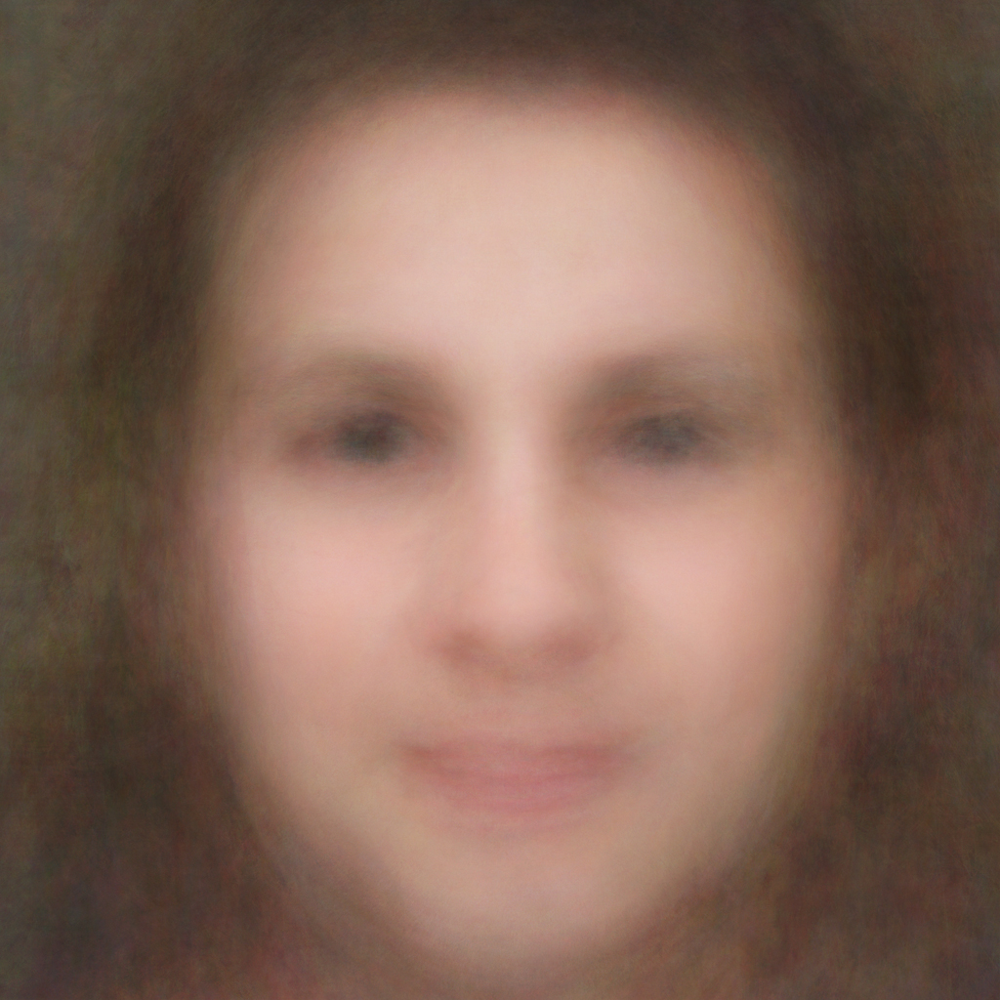

# I dreamed about a human being

How would a robot imagine a human face? “I dreamed about a human being” is like spying into a robot’s brain.

“I dreamed about a human being” is part of a project exploring the use of artificial intelligence as applied to photography by using online open source code and data. The project already has a database of 56 million images. We have freely accessible amazing tools and databases of gigantic images, but have not yet fully understood what we can do with them or what it means that they are there.

IDAAHB tries to address questions about identity, privacy, the increasing computational power and the spread of incredible powerful mathematical algorithms available for free use. Everything with a aesthetic and a educational values.

This first series of images is the result of statistical calculations on 257 faces detected by an algorithm that has been taught to recognise portraits of a specific aesthetic quality. The search was conducted over 5 million images with Creative Commons licenses posted on Flickr. “Mean”, the displayed image on the left, is the average of these 257 photographs, comprising 17 babies, 106 men, 79 women, 18 girls, 23 boys and 14 errors.

Another way of viewing these accumulated images is by seeing them pass by at full speed and blurring your vision a little. You can see the same “average effect” by watching the following video, which has 2,582 images moving at a rate of 25 images per second: <a href="http://vimeo.com/49552899">http://vimeo.com/49552899</a>

<strong>2/14/2013 update</strong>: You can also see it as "contact sheets" here <a title="Mugs from the cloud" href="http://contact-sheets-idahb.fransimo.info/">http://contact-sheets-idahb.fransimo.info/</a>

<strong>8/6/2013 update</strong>: Database has 75 millions of images and had recognized 345,625 faces.

<strong>1/25/2015 update</strong>: Database has 88 millions of images and had recognized 1,250,415 faces.

## The algorithm

The algorithm used to recognise the faces is able to find any object within a photograph, but to do this it must be shown what we are looking for through similar images.

When I began this project I was not interested in finding faces, but portraits with a specific aesthetic quality. The first step was to assemble a collection of portraits that followed this aesthetic line so that the algorithm could begin to learn it.

The composition used to train the algorithm was a series of faces viewed directly from the front with uniform lighting, eyes beneath the upper intersection points of the rule of thirds and the mouth in the lower middle third. These portraits were similar to those of passport photos or mugshots. The aim was to teach the algorithm how to locate portraits within the photographs.

In other words, the algorithm reframes a photograph in order to convert it into a passport type photo portrait. In some cases, there may not be any faces in the photograph or faces that do not meet the desired aesthetic quality and so these are ignored.

An example of the algorithm at work can be seen below in a photograph of a person against a landscape background. The algorithm recognises the face and frames it. We can see how the eyes tend to be positioned in the central lines of the rule of thirds and the mouth in the lower middle third.



The algorithm’s learning is supervised. You teach it, it learns and you assess it until you obtain a satisfactory result. Each iteration adds faces and the mistakes that it has made are explained to it.

As part of its assessment I needed to see all the images statistically described by their average, median, maximum and minimum. This is how I came across “I dreamed about a human being”. On seeing the pictures I thought: “Is this how a robot would imagine us?”

<table>
<tbody>
<tr>
<td></td>
<td></td>
<td></td>
<td></td>
<td></td>
<td></td>
</tr>
<tr align="center">
<td>Median</td>
<td>Standard deviation</td>
<td>Variance</td>
<td>Asymmetry</td>
<td>Range</td>
<td>Minimum</td>
</tr>
</tbody>
</table>

Today we take it for granted that cameras, phones, our photo software and even Facebook can recognise faces. Most people think of this as “magic”. Not only does nobody know how they do this, but also nobody questions how they do it and what else they can do.

The most fascinating thing about this subject for me is the question: What else can they learn and what can we teach them to see? The typical applications of these technologies have always been security. Commercial applications are not very far advanced. For example, to make an image database automatically catalogue itself. Similar algorithms are used for diagnostic imaging. But what can artists or philosophers use it for?

## Photography and artificial intelligence

“I dreamed about a human being” is part of a larger project exploring the use of artificial intelligence as applied to photography by using online open source code and data.

The project began in 2008 and it has a database of 56 million images with Creative Commons licenses. In 2011 the image search ended in order to begin processing the images. In later versions the system was able to add 200,000 photos per day to the database.

Ten years ago having access to these amounts of information and being able to process them on a home computer with artificial intelligence algorithms might have been considered science fiction.

The phenomenon that has led us here today involves three dimensions: digital cameras and social networks, the philosophy of open source sharing and the increased capacity of computers and networks that can be summarised in the popularisation of digital technology.

Digital cameras and social networks encourage the existence of a large number of captured and published images. These images can be accessed through public programming interfaces, which allows you to programme computers to access these images almost limitlessly.

The concepts of open source and its ideology currently no longer belong to the world of software and have expanded into usage licenses for almost any type of content. Consequently, users allow access and explicitly grant permission for reuse by publishing these images with Creative Commons licenses.

At the same time, many companies and universities have realised that releasing the code for certain parts of their research can help them sell products or develop projects with input from the open source community. As a result, quality open source exists today specialising in computer vision and artificial intelligence. The technology used in this project was developed and released by Intel, Compaq and Mitsubishi.

All this can be added to increased computing capacity and the transfer speed on the Internet.

We are all getting into digital technology as we all got into cars, although it took 100 years to see the impact on the environment. But the impact of this technology does not end up in the atmosphere; it is entering our brains and even altering its structure. It is essential that we at least try to understand the capabilities of the technologies that we are using.

## Technical FAQ

### Which algorithm was used?

Haar-like features proposed by Viola-Jones in 2001 <a href="http://en.wikipedia.org/wiki/Haar-like_features">http://en.wikipedia.org/wiki/Haar-like_features</a>

### Can I download the haar cascade?

Yes, from here <a href="http://bit.ly/S6PShC">http://bit.ly/S6PShC</a>

### How was trained?

Training was made using openCV 2.1 on Ubuntu 10.04.
For this results I used the third version of the training.
It has being done whit 209 positive and 3123 negatives samples.
Processing took 3 weeks using an Intel Core i5 650 3.20GHz x 4 processor with 12 Gigas of RAM.

### Why 257 over 5 millions?

5 millions images of 500 pixels uses almost a terabyte, the disc size I use for the photo library. Within this 5 millions, the algorithm found 166 thousand portraits, but only 257 has more than 6 mega-pixels and fill more than 70% of the original image. I though this would be a good resolution for a printed copy. “I dreamed about a human being” has 3000x3000 pixels.

### Which software has been used?

- Database: MySQL, various versions.
- Programming language: PHP and C.
- Computer vision library: openCV 2.1 and 2.3
- For human visualization: Lightroom 4 and Photoshop 5.

### How was made the statical render?

With the 3th version of trained cascade I ran a test over the library. The results were stored in MySQL.

A PHP program download high resolution images from Flickr and generates JPGs files with cropping information of detection. All these files were imported into Lightroom where images can be seen in a cropped and original version.

A group of 257 images was selected by its resolution and exported at 3000 by 3000 pixels. Most images has a bigger resolution.

Then those images were opened in Photoshop as layers and stacked into a “smart object” and rendered.
