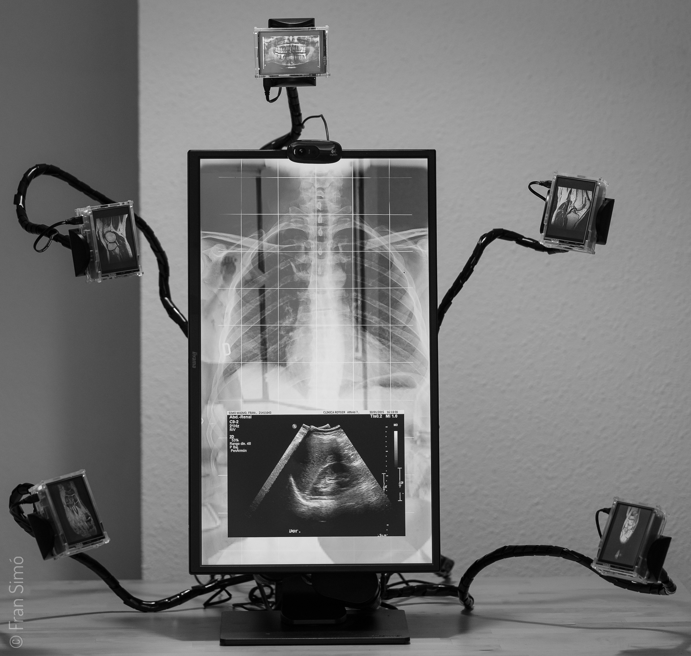

# #Selfie_v2

En los últimos años nos hemos aficionado a publicar nuestra imagen. Una imagen construida de lo que queremos mostrar de nosotros, de nuestra vida. Así creamos un personaje que publicamos, exhibimos, vendemos, a veces, incluso en busca de amor. Algunos caen en la trampa de creer que ese personaje es real, que son ellos.

En esa distopía psicológica y espiritual ver es más difícil. Proyectamos un personaje que ha nacido de convenciones propias de las redes sociales. Convenciones que se generan y evolucionan globalmente. Encarriladas por una idea de “felicidad” estandarizada y, muchas veces, dirigida por publicistas e “influencers”. ¿Hasta qué punto lo hemos elegido?

Los huesos en las imágenes, sin dejar de ser míos, son, al mismo tiempo, “iguales” o difícilmente reconocibles entre los de otros humanos. Atravieso la piel para hacerme indistinguible, hacerme uno con los demás. Por dentro me parezco más a ti.

Las imágenes provienen de estudios médicos reales solicitados por profesionales de la salud durante alguna dolencia o seguimiento. Con esto he querido usar el dolor físico como reflejo del dolor espiritual que impulsa a la sociedad a lanzarse a una construcción de un imaginario de felicidad casi obligatoria que utiliza hasta el último recurso para construir y dirigir una conducta tipificada y domesticada. Una tipificación tan salvaje como las de alguna religión que no permite votar a las mujeres pero mucho más sutil. No prohíbe, pero encamina comportamientos. Así, ni siquiera sueñas con hacer algo diferente, porque lo has “elegido” tú.

Toda esta locura nos ciega. Nos aleja de nosotros mismos. Una sociedad que consigue obligar a sus miembros a sentir la necesidad de crear, publicar y compartir una imagen de sí mismos adhiriéndose a un algún estándar es una sociedad más polarizada y estereotipada. No es libertad.

Si aún quisiéramos saber quiénes somos sólo tenemos que mirarnos a los ojos en un espejo y entrar en nuestra alma. Desde allí podríamos sentir ese “por dentro me parezco más a ti”.

Para seguir esta idea la obra refleja a los espectadores que se acercan a ella simulando un espejo que mezcla al visitante con mis huesos, adhiriendo la naturaleza dual de los espejos. Refleja la verdad y resalta la mentira dependiendo de la intención de la mirada. Puede ser usada como alegorías a: que tú y yo somos uno, que tus ojos pueden estar en mi corazón, puedes verte a los ojos y reconocerte o simplemente puede entenderse como un artilugio informático. Todo es verdad a la vez. Así recordamos que ni la imagen, ni el espejo (ni la cámara) ayudan en el camino, solo la intención puede despejar el ruido.

La obra permite al espectador llevarse un recuerdo #selfie\_v2. El stream de video puede ser capturado por la obra y descargado por el visitante.

La escultura y todas la piezas están disponibles como NFTs en [OpenSea](https://opensea.io/collection/selfie-v2-fransimo).

    

## Datos técnicos

Video escultura interactiva. 1,1m x 1,1m x 60cm.  
Resonancias magnéticas de pies y rodillas. Ecografías de riñón. Radiografías de tórax, mandíbula y dientes.  
Videos en formato GIF animado. Imágenes en JPG.

La obra está formada por 6 RasperriPis. 5 de ellas son del modelo 3 con una pantalla de 3.5” y una carcasa transparente. Estas pantallas se ubican alrededor del tórax, saliendo desde una “columna vertebral”. La carcasa transparente permite ver el interior de los mini ordenadores. El tórax está formado por una Pi modelo 4 con un monitor de 24” y una webcam.

Código fuente en [github](https://github.com/fransimo/selfie_v2).

## Curiosidades

El observador cuidadoso notará que los videos de las resonancias dan “saltos”. Las secuencias de las imágenes parecen estar “mal hechas”. El software de visualización de los estudios médicos al exportar el formato vídeo ordenó los fotogramas como 0,1,10,11,2,3. Un error informático bastante común. Al verlo me pareció muy interesante relacionar #Selfie\_v2 con [“God is in the bugs”.](https://fransimo.info/es/blog/2021/07/31/god-is-in-the-bugs/)

## Galería

 

  

  

  

