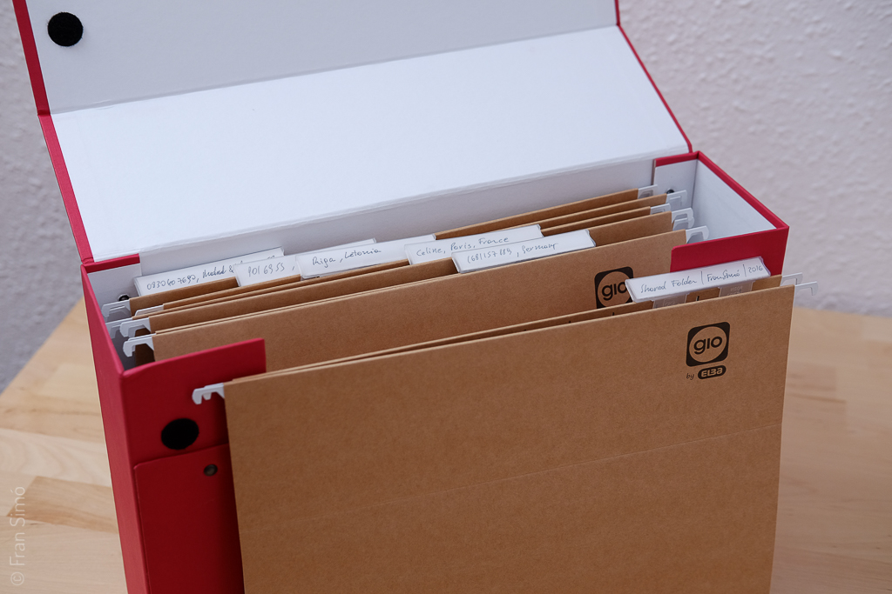
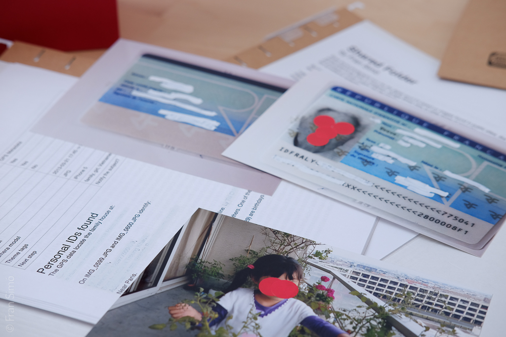
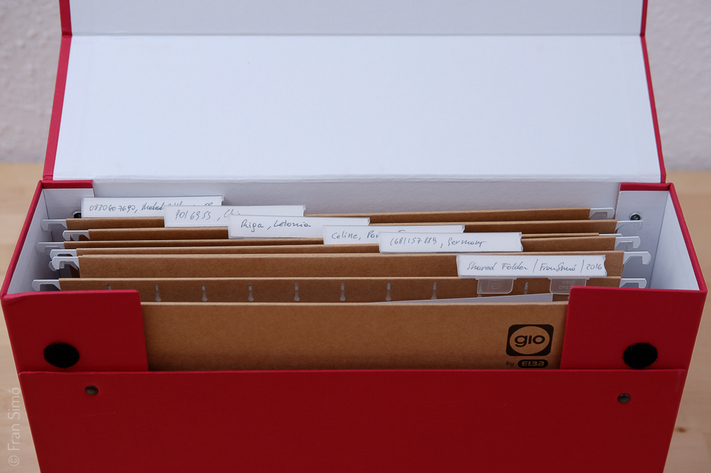

{}
```
Art book (2015-2016)
10,50 x 20,50 x 38cm
29 A4 80gm pages
57 13x18cm photographs  
6 Folders
```
{}


# Shared Folder (Red box)

In the context of the digital era, _[found photography](https://en.wikipedia.org/wiki/Found_photography)_ means images found on public websites such as the social networks, e.g. Flickr, Instagram, Google Street View, etc. In these cases, the author of the images meant for them to become accessible (even if only out of legal obligation, as it happens with surveillance footage).

But the original found photography was about photos that were never intended to be public. Their authors didn’t publish them. They had been kept in boxes for years.

I asked myself: Where can I find these images? Where are the digital images that were never intended to be shown? Should I buy obsolete hard drives at flea markets? Should I maliciously hack online computers?



Then I remembered the old-school sharing protocol: eDonkey with its primitive clients.

At the beginning of 2000s ed2k client installation used to automatically share “My Documents” folder. Windows put “My Photos” under “My Documents” so any standard installation shared all the photographs that were downloaded from digital cameras and phones.

Are people sharing all their images by mistake without knowing it? How much private information are they sharing?

In 2015 I started to systemically search images in the ed2k network.

_Shared folder_ shows what I’ve discovered.



# Technical data

## The book

I want viewer to have the same experience I have when I look for images, transforming a mental/digital experience into a physical one.

**How much you going to find out about these people?**

You’ll find a box and you’re going to open it. Inside you’ll discover folders that contain personal/intimate information about those people. The data is masked but if you remove the gommettes, the ink under the correction fluid (Tipp-ex) is visible against the light. The ed2k links are there, you onlyneed to paste them into a ed2k client. I made the code public to perform a massive search.

I assume the images are shared by mistake. **Is going further into the investigation a violation of intimacy?** I create the book as a medium to put the public in the position to choose.

**How much data/images are you sharing without knowing it?**

## Book dummy

The final book will be a box with folders inside with the same dimensions of the dummy. It’ll contain pictures and pages inside the folders. Pictures will have gommettes on them.  
Pages will have Tipp-exover the sensible data.  
Some details may be changed to avoid commercial brand advertising and improve the overall quality of the object.

## Searching

To search and download I use mldonkey server. It has an interface to automate actions such searches and downloads. Part of the search was manual, mostly RAW files. For JPG I used a simple algorithm which searches the pattern IMG\_0001, IMG\_0002, IMG\_0003…

You can find the code here https://github.com/fransimo/shared_folder (GPL license)

## Classifying

I use the camera serial number on EXIFs data for the first grouping. This gives me the opportunity to follow a camera.

For the mobile phone images that have no serial number, I use GPS data. All GPS data images are grouped manually and I personally check for patterns.

## Stats

The library contains 17934 images after having deleted pedophilic images, which represent 13% of downloaded files.  
4469 images have camera serial number (3747 are JPG and 722 RAW)  
2405 image have GPS data.



# Full content


[PDF Download](Shared_folder_with_photos_and_scan.pdf)