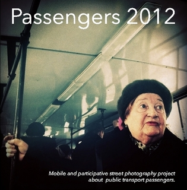



<--->
Passengers is a website as well as a series of street photography books about the passengers who use public transport.
The project was developed as a web participatory concept. All of the images were captured with mobile devices and
published on Instagram. The website gives a real time look at participation while the books are a visual contemplation
about public transport passengers, mobile device aesthetics and street photography.  


The books contain short essays about the “state of art” and its relationship to society, history, the individual, and
the creative processes used in Passengers.

In December 2011, [the first volume of Passengers](http://passengers-streetphotography.com/eds/#Passengers) came out.
With just four authors and almost exclusively images of Barcelona, it was the first step of the adventure that today has
converted into the second volume of the series: Passengers 2012.

This installment consists of 105 images by 36 authors from 25 cities. We have received photographs from Brazil, Russia,
the United States, Japan, France, Spain, Turkey, Chile, Sweden, China, Venezuela, Italy, Germany, Switzerland, Holland,
Hungary, Serbia, Bulgaria, England, Czech Republic, Honduras, Hong Kong and Guatemala: 23 countries in total.

The project has to do with street photography in its most documentary sense. The objective of this series of books is to
register our time and space through the very technologies of the beginning of this century: technologies that not only
apply to the process of capturing images but also to the process of editing and publishing them. This means that the
capture and the post-processing are done with mobile devices that publish to social networks, which are connected to
their own systems that create a website in real time, and then everything ends up in books printed on demand.

The growing connectivity and ubiquity of the image give to this time and place a certain shape as well as a
characteristic distance. Our interest in documenting the street is based on the emotion we feel today when we see images
from 1950 shot in New York, Barcelona or Chicago. Additionally, Passengers gives us a chance to portray the entire world
in unison through the eyes of various authors from different places, at the same time, in a shared experience of the
mundane.

The authors of Passengers don’t go on public transport to take photos; we are there because we commute just like anyone
else. Our nexus is the journey. Public transport is a stage of a play in which we are actors as well. How can one get
closer to a story than being a part of it? What better way can there be to document? Passengers is written in first
person but in plural.

Reading the classics of street photography such as Many Are Called by Walker Evans or Robert Frank’s The Americans, not
only do we meet the characters of that era but also see them surrounded by the attributes of that time: fashion,
typography, the news in the newspapers, cars, advertisement with its messages. We’d like for someone in the future to
find these first tablets to be of historical curiosity: the faces of the financial crisis, the last books? Who knows how
the present will be interpreted in the future. What we do know is that we have to capture, organize, package, and save
this moment in this time capsule that is a book. That’s the purpose of this series.

Passengers is a project by Fran Simó for Barcelona Photobloggers. This volume has been directed and edited as a team
effort by: Marcelo Aurelio, Godo Chillida, Benjamin Julve and Fran Simó. In the
section [“Participatory Process through the Web”](http://passengers-streetphotography.com/participative-processes-on-the-web-making-of-passengers-2012/),
you can find more information about the process that we’ve used in this book and our experiences.

You
can [browse the book on screen](http://issuu.com/FranSimo/docs/es_passengers_2012-e-version?e=2922899/5647894), [download it as PDF](http://passengers-streetphotography.com/wp-content/uploads/2012/book/es_Passengers_2012-e-version.pdf)
or [buy a printed one](http://www.lulu.com/shop/barcelona-photobloggers/passengers-2012-versi%C3%B3n-en-espa%C3%B1ol/paperback/product-21250175.html).

