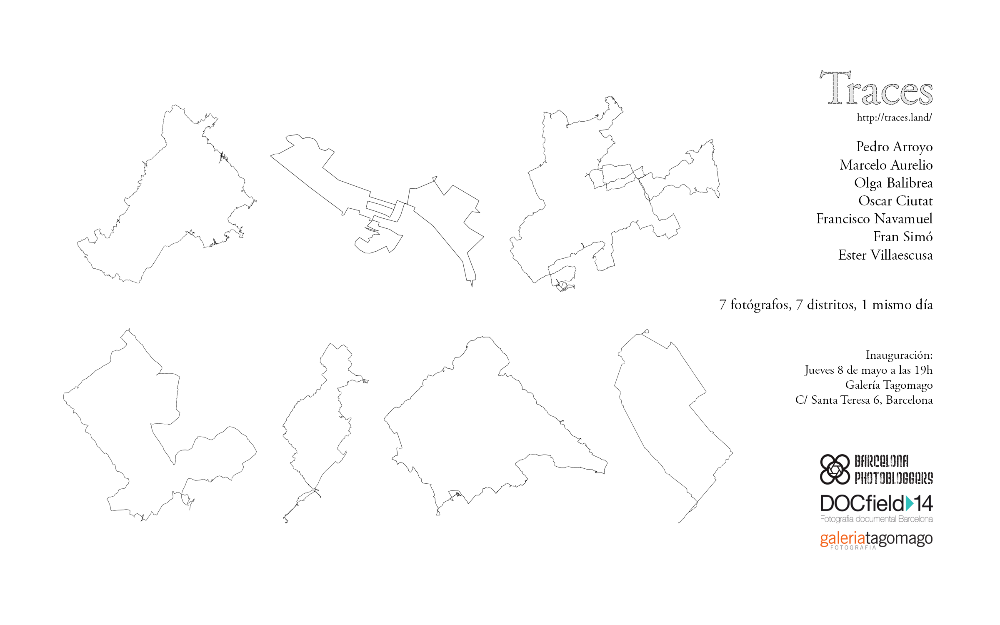

[Traces](http://traces-barcelona.fransimo.info/) is a collective project that provides a chance to experience a dérive \[literally: “drifting”, a technique of rapid passage through varied ambiances\] and verify its capacity to document urban space from different perspectives while using a common methodology and creating a psychogeographical map of Barcelona.

Following the concept of a dérive proposed by Guy Debord, on the 7th of December, 2013, seven authors photographed the city, guided by intuition. The starting point for each author as well who would be his editor was chosen by a drawing. The same day the route was completed; each photographer turned in 100 photos in order for another author to select 21 of them.

The world “trace” in English means to find or discover something through the means of investigation; to discover the origin of something in time; to follow a route; to copy or draw a map and, at the same time, proof of existence of something in time (an imprint or a mark).

The fact that the capturing and the first edition are based on intuition doesn’t mean that the project is taken lightly. The process is part of the project.

## Rules of a dérive

The goal of having rules for the dérive is to simplify. This way, during the dérive we only worry about the experience itself.

### 1\. Use a comfortable camera.

Being able to move unrestrictedly is fundamental for letting your intuition guide you freely.

### 2\. Choose a day for the dérive. This day will be dedicated to it completely.

There can’t be any premeditated stops or activities at this time that aren’t a result of coincidence. The 7th of December, 2013, was the day we chose chosen. In order to have a starting point, the seven of us divided the districts of the city at random.

### 3\. Come out into the street, turn on your GPS and surrender to your intuition.

During the first meetings we decided that it would be interesting to make a “photo” of the city on some particular day and assign the starting points of the dérives randomly.

### 4\. Shoot every time something draws your attention.

Be it pretty, ugly, strange, boring or fun… whatever makes you stop.

### 5\. After making a shot, don’t let it trap you, move on to the next one.

We often tend to repeat ourselves but if we stay on a subject, situation or object, we won’t be able to keep walking.

### 6\. Go on for at least two hours and change direction to return.

It’s important for everyone to always feel comfortable. It’s necessary to set a time limit because you will have to upload the photos, edit and post-process them the same day.

### 7\. Download the photos and select 100 using your intuition.

Use a simple and fast viewer to look at each photo for just two seconds. If one draws your attention, mark it, otherwise go on to the next picture.  
Just like the route and the shooting are based on intuition, editing follows the same concept. Also, it has to be immediate as to not give new interpretations of the experience a chance to surface.

### 8\. Apply post-processing that defines your style to these 100 photos.

At this point, those who work with complex processes have to find a way to be able to turn in the photographs the same day or allot more time for such processes during the same day.

### 9\. Send the photos to the team manager.

He receives all of the photos and distributes them among all of the authors-editors for final selection.  
This set of rules also allows for repetition between different individuals in different locations and moments of time. Repeatability is one of the main characteristics of an experiment. Traces, scientifically speaking, could be considered just a method for collecting data for analysis. We would have to repeat the experience many times in order to be able to analyze the results and come up with a hypothesis.

## Editing Method

Each author receives 100 photographs from another one and has to select 21 images for the book. The editors are chosen through a drawing. This edition doesn’t have a fixed method like the other aspects of the process. Each editor can use the criteria that he prefers. The only condition is to do it with dedication and concentration, not allowing for any distractions. He can interact with the photographer to ask him questions. He can’t increase the number of images beyond 100.  
The order in which the images appear in the book is always sequential and is based on the time of capture because they narrate a route. It’s not about re-writing a new story about the photos. The editor has to find the essence of what the author saw.

## Initial Motivation for the Project

Looking for the essence of cities through their inhabitants led me in the wrong direction. Every time I got closer to the subject, closer to humanity, but further away from the city.  
I started to feel that I was omitting something important. That’s when I ran across Stephen Shore’s _The Book of Books_, Antoine D’Agata’s _Psychogéographies_ and through him, into Guy Debord.

I decided I had to return to the origin. Go out with no plan in mind with the camera just to take photos, without them having to fit into a series or have an objective. To return to shooting unconsciously, to just seeing without any pretext. To return to [“intuitive photography”](http://barcelonaphotobloggers.org/2009/01/01/fotografia-intuitiva/?referrer=Baker).

It’s part of my normal creative process to do things that don’t have an explanation, that seem unconnected, but that end up making sense. A moment comes when “the dots are connected”. _Traces_ unites Debord, Ginsberg (_First Thought, Best Thought_), D’Agata and Shore. I defined the 7 rules for the dérive and went out into the street.

After going on various dérives, I understood that the experiment couldn’t be complete if just one author participated. I’ve never been convinced that the figure of the author should be in the center of artistic creation, at least not as the only way. I’m fascinated by the dilution of the author in the group and the creation of group identity in order to get a more objective result, in this case, a more documentary one. This project is the result of a process that combines talents as well as negotiates between egos.

It wasn’t hard to find good partners for getting lost in Barcelona and getting together for a project that has transformed itself and evolved in order to become what you can enjoy now.

[http://traces-barcelona.fransimo.info/](http://traces-barcelona.fransimo.info/)

Traces is a Fran Simó's project for [Barcelona Photobloggers](http://barcelonaphotobloggers.org/).