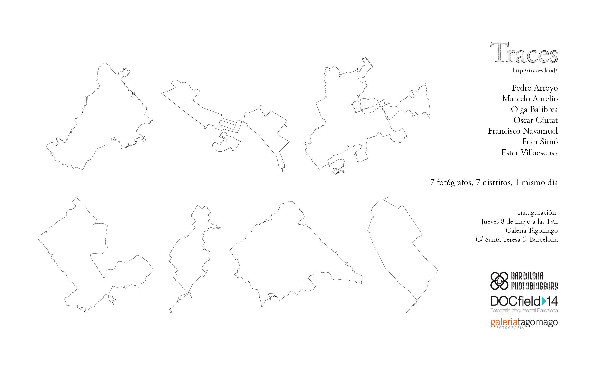

2012-2014  
Proyecto transmedia participativo: app, libros, video e instalación.

[Traces](http://traces-barcelona.fransimo.info/) es un proyecto colectivo para experimentar la “deriva” y verificar su capacidad para documentar un espacio urbano desde distintas perspectivas con una metodología común, creando un mapa psicogeográfico de Barcelona.

Siguiendo el concepto de “deriva” propuesto por Guy Debord, el 7 de diciembre de 2013, siete autores fotografiamos la ciudad guiados por la intuición. El punto de partida de cada autor y su editor se escogieron por sorteo. Al terminar el recorrido, ese mismo día cada fotógrafo entregó 100 fotos para que otro autor realizara una edición de 21 fotografías.

Traces es un conjunto de libros de fotografía y una exposición. Los libros se distribuyen en formato de impresión bajo demanda, web y electrónico en una [aplicación para dispositivos móviles.](https://itunes.apple.com/us/app/traces/id866756528?ls=1&mt=8)

La exposición se podrá ver en la [Galería Tagomago](http://tagomago.com/), del 8 de mayo al 14 de junio del 2014. C/ Santa Teresa 6, 08012 Barcelona [(mapa)](https://maps.google.es/maps?q=Carrer+Santa+Teresa,+6,+Barcelona&hl=en&sll=41.39479,2.148768&sspn=0.164317,0.334053&hnear=Carrer+Santa+Teresa,+6,+08012+Barcelona&t=m&z=16)

Los fotógrafos que han participado en el proyecto son: [Pedro Arroyo](http://www.pedroarroyo.es/), [Marcelo Aurelio](http://marceloaurelio.com/), [Olga Balibrea](http://www.olgabalibrea.com/), [Oscar Ciutat](http://oscarciutat.com/en/), [Francisco Navamuel](http://www.francisconavamuel.net/), [Fran Simó](http://fransimo.info/) y [Ester Villaescusa.](http://estervillaescusa.com/)

La palabra “trace”, en inglés, significa: encontrar o descubrir algo por medio de una investigación, descubrir el orígen de algo en el tiempo, seguir una ruta, copiar o dibujar un mapa y, al mismo tiempo, la indicación de la existencia de algo en el tiempo (huella o rastro).

Basar la captura y la primera edición en la intuición no significa que el proyecto se haga a la ligera. El proceso es parte de la obra.

## Reglas de deriva

El propósito de tener reglas en la deriva es simplificar. De esta manera, en el momento de la deriva nos preocupamos solo por el experiencia en sí misma.

### 1\. Usa una cámara cómoda

Sentirse libre de movimiento corporal es fundamental para dejar que la intuición nos guíe con libertad.

### 2\. Elige un día para la deriva. El día se dedica completamente a ella.

No puede haber paradas predeterminadas ni actividades dentro de él que no sean fruto de la misma casualidad. El 7 de diciembre del 2013 fue el día que escogimos. Los siete autores nos dividimos los distritos de la ciudad por sorteo para tener un punto de partida.

### 3\. Sal a la calle, enciende el GPS y entrégate a tu intuición.

Tras las primeras reuniones decidimos que sería interesante hacer “una foto” de la ciudad, un día determinado y dividir los puntos de inicio de las derivas al azar.

### 4\. Dispara cada vez que algo te llame la atención.

Por bonito, feo, raro, aburrido o divertido… cualquier cosa que te detenga.

### 5\. Después de ese disparo, no dejes que te atrape, sigue al siguiente.

Muchas veces tendemos a repetirnos, pero si nos quedamos en un tema, situación o sujeto no podremos seguir andando.

### 6\. Sigue al menos 2 horas y cambia el sentido para regresar.

Lo importante es que cada uno se sienta siempre cómodo. Es necesario pensar un tiempo límite porque luego hay que descargar las fotos, editarlas y aplicarles el post-proceso en el mismo día.

### 7\. Descarga las fotos y escoge 100 también utilizando la intuición.

En un visor sencillo y rápido, pasa cada foto dejándola solo dos segundos. Si una te llama la atención la marcas, sino pasa a la siguiente.

Así como el trayecto y el disparo se basan en la intuición, la edición sigue el mismo concepto. Además, debe ser inmediata para no dar margen a más interpretaciones que la experiencia vivida.

### 8\. A esas 100 fotos aplícale el post-procesado que define tu estilo.

En esta etapa quienes trabajan con procesos complejos deben encontrar una aproximación para poder entregar las fotografías en el mismo día o reservar más tiempo para procesar dentro del día.

### 9\. Enviar las fotografías al gestor del equipo.

Este recibe todas las fotos y las reparte entre los autores-editores para la edición final.

Un conjunto de reglas también nos permiten la repetición, entre varios individuos, en diferentes lugares y momentos. La repetibilidad es una de las características principales de un experimento. Traces, científicamente hablando, podría ser considerado solamente como un método de toma de datos para análisis. Deberíamos repetir la experiencia muchas veces para poder analizar los resultados y plantear hipótesis.

## Método de edición

Cada autor recibirá 100 fotografías de otro autor y debe escoger 21 imágenes para el libro. Los editores se sortean. Esta edición no tiene método fijo como las otras partes del proceso. Cada editor puede utilizar el criterio que más le guste. La única condición es hacerlo concentrado y entregado al tema, sin distracciones. Puede interactuar con el fotógrafo para hacerle preguntas. No puede ampliar las 100 imágenes.

El orden en la que aparecen en el libro es siempre secuencial, según la hora de captura porque narran el trayecto. No se trata de reescribir una nueva historia sobre las fotos. El editor debe buscar la esencia de lo que vio el autor.

## Motivación inicial del proyecto

Lo que había sido una búsqueda de la esencia de las ciudades a través de sus habitantes me estaba llevando a lo contrario. Cada vez me acercaba más al sujeto, me acercaba a la humanidad y me alejaba de la ciudad.

Sentía que estaba dejando algo importante. Fue cuando conocí el trabajo The Book of Books de Stephen Shore, las Psychogéographies de Antoine D’Agata y por éste, a Guy Debord.

Decidí que tenía que volver a los orígenes. Salir sin rumbo con la cámara solo para hacer fotos sin que éstas tuvieran que encajar en una serie o tener un objetivo. Volver a disparar inconscientemente, a ver sin más. Volver a la [“fotografía intuitiva”](http://barcelonaphotobloggers.org/2009/01/01/fotografia-intuitiva/).

En mi proceso creativo es normal que haga cosas que no tienen explicación, que parecen inconexas, pero que acaban teniendo sentido. Llega el momento en el que “se unen los puntos”. En Traces se unen Debord, Ginsberg (“First Thought, Best Thought”), D’Agata y Shore. Definí las 7 reglas para la deriva y salí a la calle.

Después de hacer varias derivas, entendí que el experimento no podía estar completo si solo lo ejecutaba un autor. Nunca me ha convencido la figura del autor como centro de la creación artística, al menos, no como único camino. Me interesa mucho la dilución del autor en el grupo y creación de la identidad grupal para un resultado más objetivo, en este caso, más documental. La obra es el resultado de un proceso de suma de talentos y negociación de egos.

No fue difícil encontrar buenos compañeros para perdernos en Barcelona y unirnos en un proyecto que se ha transformado y evolucionado para convertirse en lo que ahora podéis disfrutar.

[http://traces-barcelona.fransimo.info/](http://traces-barcelona.fransimo.info/)

Traces es un proyecto de Fran Simó para [Barcelona Photobloggers](http://barcelonaphotobloggers.org/).