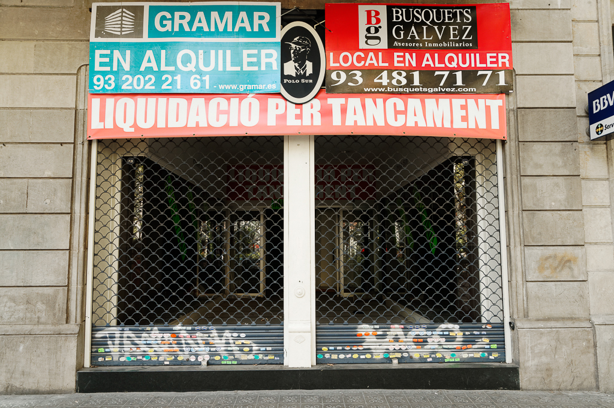

# Es lloga (Se alquila)

2009-2010

> 17/11/2009 Diario: La Vanguardia. Barcelona. (Redacción).- El paro no cesa de aumentar en España y castiga con más crueldad a las pequeñas y medianas empresas. Se calcula que, cada día, 500 autónomos pierden su trabajo y cada semana, unas 4.000 empresas se ven obligadas a cerrar. Las pequeñas y medianas empresas catalanas se manifestarán mañana de nuevo ante el Congreso...

El cierre de miles de pequeños comercios es solo la cara expuesta de un drama más complejo. Cada tienda que cierra afecta al propietario, sus empleados, sus proveedores y las familias de todos ellos.

Cada una de estas puertas encierra sueños robados por un cataclismo financiero cuyos responsables no tienen nombre, ni culpa, ni castigo. **Todos esos sueños ahora están disponibles “para alquilar”**.

El capitalismo, en estado puro, exalta un espíritu emprendedor, creativo, el coraje, la constancia y el valor del intercambio. Como consecuencia de ese espíritu se genera riqueza, empleo, tecnología y bienestar.  En el lado opuesto la avaricia, la opulencia, la falta de escrúpulos y el egoísmo lo destruyen.

Esta crisis no es el resultado de un ataque externo. Aquí no hay enemigo. La bomba la hemos puesto nosotros mismos. Para que el capitalismo sea sostenible debe existir un equilibrio entre el espíritu creador y la avaricia.

Los mecanismos de autocontrol del sistema no funcionaron. Nadie escucho a los analistas que advirtieron de la situación y la rueda de los dividendos rápidos en base a riesgos elevados acabo por salirse del camino.

Cada vez que pienso en la crisis y sus responsables recuerdo aquella línea de Bruce Springsteen en Youngstown “Once I made you rich enough, rich enough to forget my name”.





[Picturing An Ethical Economy Press Release](PicturingAnEthicalEconomy_PressRelease.pdf)