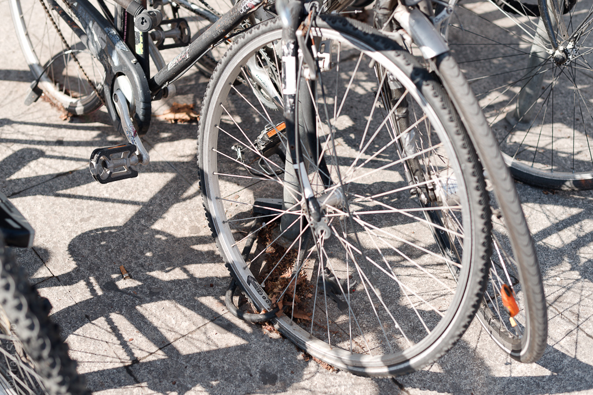

# Traces (derivas personales)  

*Traces* es una serie de caminatas no planificadas a través del paisaje urbano, basadas en la *Dérive* (“Deriva”) de Guy Debord.  

El propósito de la caminata es tomar fotografías, nada más. Siempre es circular: comienza y termina en el mismo punto.  
Ocurre dentro de un mismo día. Dejo que mi subconsciente elija la dirección. Disparo cada vez que veo algo que capte mi atención, sin importar qué sea. No busco ninguna correlación con otras series en las que estoy trabajando, pero tampoco la rechazo.  

*Traces* es una práctica meditativa que explora la relación entre el consciente y el subconsciente a través de la fotografía. Una sola deriva no es suficiente. Para comprender esta relación y sus consecuencias fotográficas, el experimento debe repetirse. La repetición necesita reglas. Las reglas obligan al autor a enfocarse en el subconsciente y experimentar la deriva.  

Las siete reglas de la deriva son:  

1. Usa una cámara cómoda. La libertad de movimiento del cuerpo es esencial.  
2. Elige un día libre para la *Dérive*. El día entero estará dedicado a ella.  
3. Sal a la calle y entrégate a tu intuición; ella te guiará por la ciudad. Usa un rastreador GPS para registrar tu ruta.  
4. Toma una foto cada vez que algo llame tu atención.  
5. No te quedes atrapado en esa imagen, sigue adelante, sigue moviéndote.  
6. Sigue el proceso durante al menos dos horas y cambia de dirección hacia el punto de inicio de la caminata.  
7. Al llegar a casa, descarga todas las imágenes y míralas durante 2 segundos por foto. Califica y selecciona sin pensar, solo por impulso. Repite la selección hasta quedarte con 21 fotografías.  

## Orígenes  

Hace algún tiempo vi la entrevista de Stephen Shore con Phaidon Press sobre *The Book of Books*. La idea de hacer un libro en un solo día, desde tomar las fotos hasta tener una copia “en camino”, me cautivó. Desde 2003, he practicado la *Dérive* como método para tomar fotografías. No estoy muy seguro de cuándo “todos los puntos se conectan” en un proyecto, pero el 14 de febrero de 2013 salí con una cámara y me entregué a mi subconsciente. Ese día escribí las reglas.  

## Como derivas colectivas  

Comencé *Traces* como un proyecto personal, pero pronto decidí experimentarlo de manera colectiva. Lo abrí a la colaboración buscando a seis autores más para retratar Barcelona. El proyecto colectivo [se exhibió en Barcelona en la *Galeria Tagomago* en mayo de 2014](http://fransimo.info/blog/2014/05/02/traces-2013-12-07-barcelona/ "Traces Tagomago").  

## Galería  
  
  
