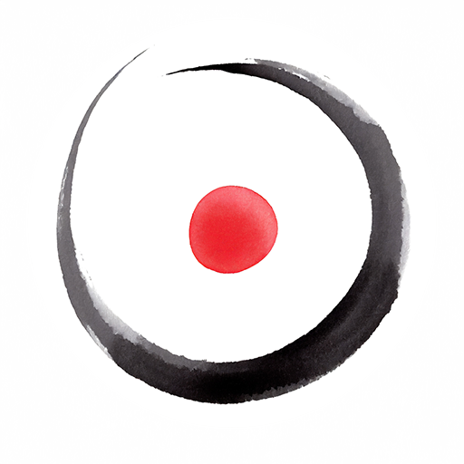

{}

<--->
He dado masajes desde niño. He aprendido, y sigo aprendiendo técnicas, pero **la esencia es tocar con neutralidad
desde el corazón** y dejarse llevar por ese _algo_ que no podemos comprender y que nos ayuda en todo momento.

Durante el masaje, mi trabajo es abrirme y convertirme en un canal para que la voluntad de nuestros seres se manifieste aquí y ahora.

{}

Desde lo más sutil, como la [tameana](tameana.md) y la [biodinámica craneosacral](biodinamica_craneosacral.md), hasta
el [masaje tántrico](masaje_tantrico.md), podemos explorar caminos para expandir tu conciencia, recordarle a tu cuerpo 
cómo restaurar su salud inherente o encontrar un momento de paz.

Si sientes el llamado, puedes ver los [servicios y precios](precios.es.md) y [llamarme](../contact).

**¡Que nuestros corazones iluminen el camino!**
