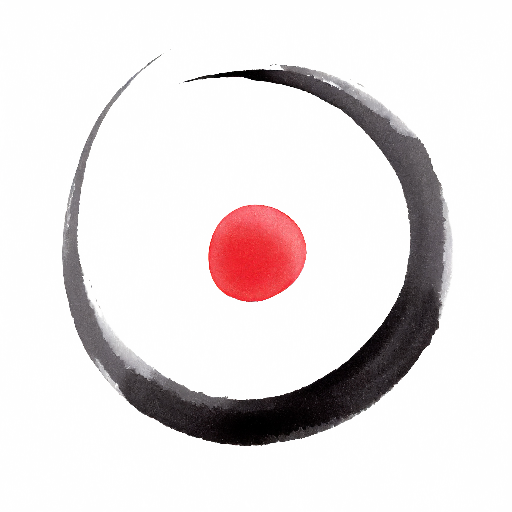

{}

<--->
Cuando los cuerpos se tocan desde el amor sanan.

He dado masajes desde niño. He aprendido, y sigo aprendiendo técnicas, pero **la esencia es tocar desde la neutralidad 
con amor** y dejarse llevar por ese _algo_ que no podemos comprender y que nos ayuda en todo momento.

Durante el masaje mi _trabajo_ es abrirme al amor y ser un canal para que la voluntad de nuestros seres obre aquí y ahora.

**¡Qué nuestros corazones iluminen el camino!**

{}

___

