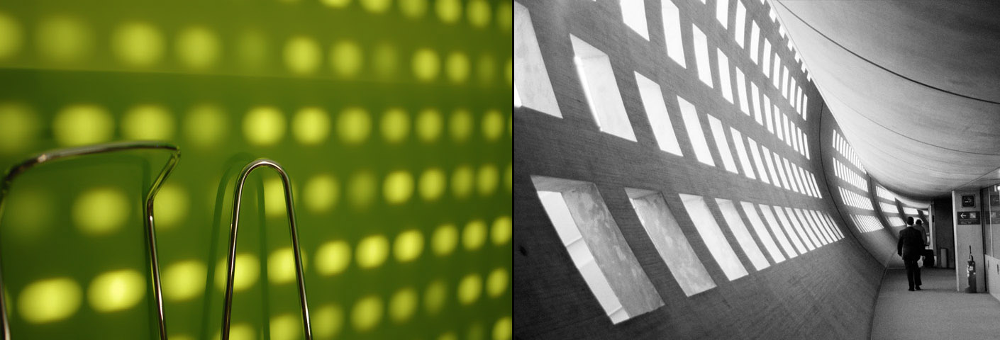

Las fotografías de [inside Out](http://i-o-p.es/) desnudan dos mundos interiores. Los caminos escogidos por los autores se dividen al elegir las formas y los elementos del lenguaje fotográfico. En el exterior, la búsqueda se hace en las grandes estructuras. En el interior en las pequeñas cosas de cada día. Reuniéndose en líneas de composición semejantes que crean parejas contrapuestas.

**Fecha:** Del 19 de abril al 18 de mayo de 2007

**Lugar:** [Escola Da Vinci](http://davinci-barcelona.com/), C/ Cucurulla 9 – 1º, 08002 Barcelona [(mapa)](http://maps.google.es/maps?f=q&hl=es&q=c/cucurulla+9,08002,+barcelona&sll=39.46684,-0.377954&sspn=0.011248,0.019913&layer=&ie=UTF8&om=1&z=16&iwloc=addr)

**Precio:** Entrada gratuita  
**Reacciones:** [Quintin Lake](http://blog.quintinlake.com/2009/11/11/inside-out-website-explores-photographic-diptych-as-a-means-of-representing-architecture/)

**Música:**  
<audio class="player" controls preload="none" src="01-insideOut.mp3" type="audio/mp3"></audio>


