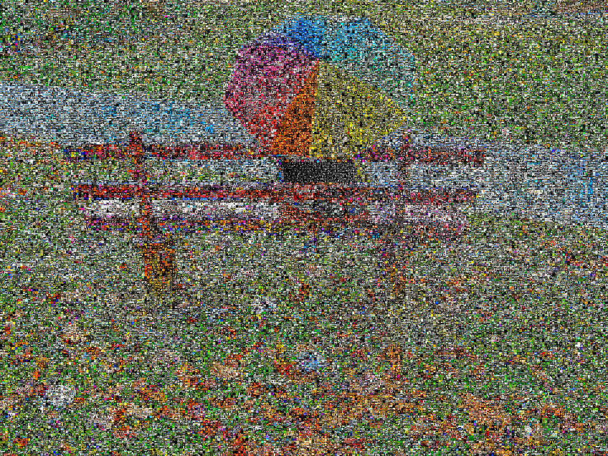

[Rainy Day](http://www.flickr.com/photos/summerfeelings/3030122090/) como flickrGrama.

Este es un proyecto en el que estoy trabajando llamado **flickrGramas**.

Esta es una versión muy inicial, mi primer intento. Las mejoras futuras incluyen:
1) Usar solo imágenes permitidas por licencias Creative Commons derivadas  
2) Crear flickrGramas por etiquetas (por ejemplo, un rostro formado por miles de imágenes de rostros, un día lluvioso formado por miles de imágenes relacionadas con la lluvia)  
3) Mejorar las técnicas de indexación de color

Resolución más alta disponible [aquí](3049300655_8ca88c85b5_o.jpg) (1.800px)  
Resolución completa disponible [aquí](http://entregas.fransimo.info/flickrGramas/3030122090/fG_3030122090_ps.jpg) (18.000px, 106MB).

Este flickrGrama contiene 43.200 píxeles representados por 22.938 imágenes diferentes.

Los flickrGramas son una evolución del software de la [Exposición Elements](http://elements-barcelona.com/).

