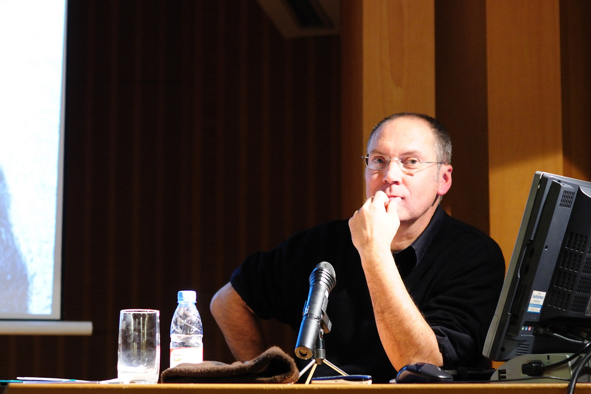

De camino a la [charla](http://barcelonaphotobloggers.org/2008/10/17/ciclo-de-charlas-iconos-maestros-de-la-fotografia-en-imagenes/) pensaba «el pesado de Cartier-Bresson otra vez ¿no hay otro de quién hablar?» pero como el ponente era Pepe Baeza me anime a ir y valió la pena, la ponencia fue amena y el tema me ha hecho revisar todo lo que pienso sobre fotografía.La fascinación que todo el mundo parece tener por Henri Cartier-Bresson me tiene harto. ¿La fotografía solo es un instante? [William Klein](http://www.masters-of-photography.com/K/klein/klein_boy_pointing_gun.html) decía la vida de un fotógrafo son unos segundos, la suma de cientos de instantes a 1/125s. ¿Cuántas fotografías llegas a conocer de un fotógrafo? Se preguntaba ¿Cuanto conoces de su vida 1 segundo, 2…?

Entiendo que cierto tipo de fotografía se rinde al momento, pero el culto a HCB me parece desproporcionado. Cuando vi por primera vez [A View From an Apartment](http://www.tate.org.uk/modern/exhibitions/jeffwall/rooms/room12.shtm) me fascinó, más lo hizo cuando me enteré que [Jeff Wall](http://es.wikipedia.org/wiki/Jeff_Wall) había alquilado el piso y hecho vivir a una de las modelos en él por casi un año para hacer la fotografía. Definitivamente hay más en la fotografía que “el instante decisivo”.

Pero esta “rabia” proviene más de la marca HCB que de su fotografía o su pensamiento. Siendo realistas sin marketing nada tiene éxito y HCB hizo un excelente marketing de su trabajo, tanto que se convirtió en un Dios de la fotografía y eso me molesta.

Una de las frases de Pepe fue lo que acabo de desatar mi furia, una recurrente en las charlas y en todas las conversaciones “artísticas” relacionadas a la fotografía: “la coherencia”. ¿Qué es ser coherente? Por lo que he llegado a entender ser coherente es algo así como ser inútil, es decir, hacer lo mismo durante toda la vida, y, además defenderlo. Una cosa es trascender por una etapa de tu desarrollo artístico, como podría ser el cubismo, pero otra, muy diferente es haber utilizado solo una técnica durante toda tu carrera. Si después de 10 años de hacer lo mismo no lo haces mínimamente bien o no te has inventado un “discurso” para venderlo es que eres demasiado inútil, es decir, que no llegas ni a ser coherente.

¡Ah! Por cierto, ¡[Cindy Sherman](http://en.wikipedia.org/wiki/Cindy_Sherman) también es coherente! Y es aún más inteligente, deja que el discurso se lo escriban mientras sigue jugando a disfrazarse frente a la cámara, como lo hacía por hobby en las fiestas de adolescente…

Todas estas rabietas tienen un cosa en común, el mercado del arte. Ser “coherente” es la única manera de ser vendible. El mercado es corto de vistas, no entiende sino es capaz de encasillar. Haz de tener “un estilo”, “ser reconocible”, “ser marca” y la mejor manera de conseguirlo es hacer siempre lo mismo.

[Guillermo](http://www.desenfocado.com/), victima contestataria de mis dudas existenciales, me dijo que buscaba genios no fotógrafos… vamos, que “se me iba la perola”… Tal vez pido demasiado. Es que soy de los que creen en la búsqueda, estoy acostumbrado a ver retrospectivas de artistas que han hecho de todo en su vida y durante toda su vida.

¿Qué pasaría si Metálica se pusiera a tocar Sardanas? ¿Les dejarían? ¿Sabrían? Tranquilos la discográfica no les dejará.

Lo que no me esperaba era la relación con el budismo, eso cambio mi relación de aburrimiento-odio a una de amor-odio con HCB. Esto es lo que me hecho publicar la entrada con tanto retardo. Pepe ha conseguido que me lea [_Fotografiar del natural_](http://www.gustavogili.es/ficha_amp.cfm?IDPUBLICACION=550) y [_Zen en el arte del tiro con arco_](http://www.aliarc.es/docs/EUGEN%20HERRIGEL-Zen%20en%20el%20arte%20del%20tiro%20con%20arco.pdf) y medite sobre cómo fotografío, cómo miro, he mirado y quiero mirar. 
El resultado es [Fotografía intuitiva](01_fotografia_intuitiva).

Originalmente publicada en [Barcelona Photobloggers](http://barcelonaphotobloggers.org/2009/01/01/henri-cartier-bresson-marca-registrada/)
