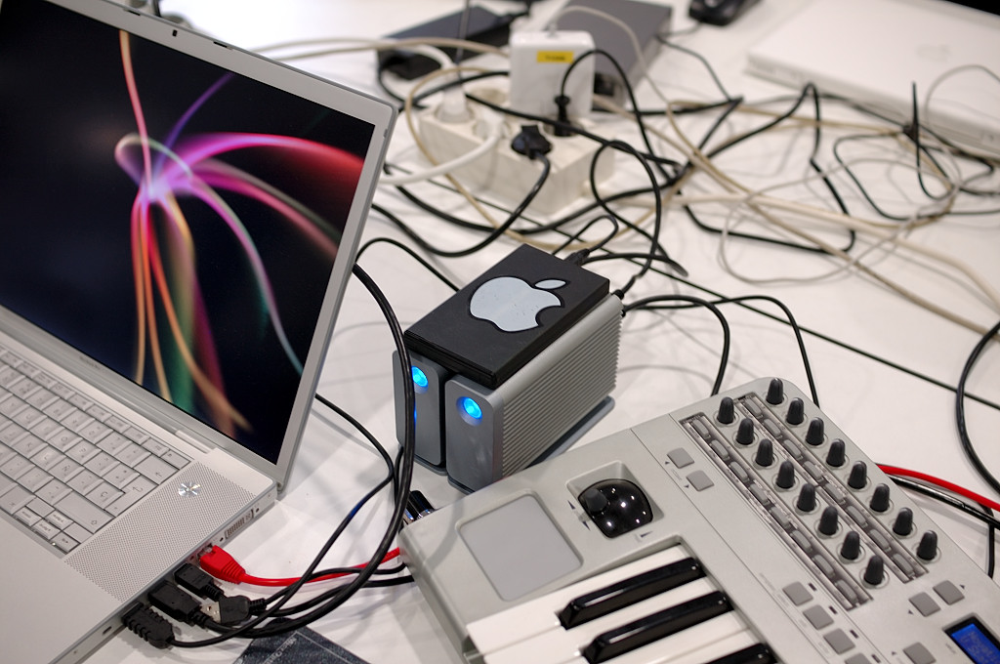

> _"El meramente curioso no tiene derecho… El Zen, como toda mística, será comprendido únicamente por un místico que… no sucumbirá a la tentación de obtener en forma subrepticia lo que la experiencia mística le niega"_ (Nota del traductor en: _Zen en el arte del tiro con arco_)

En la [charla de Pepe Baeza](https://fransimo.info/es/blog/2009/01/01/?p=745) me enteré que [Braque](http://es.wikipedia.org/wiki/Braque) le había recomendado a Henri Cartier-Bresson la lectura del libro _Zen en el arte del tiro con arco_ de [Eugen Herrigel](http://en.wikipedia.org/wiki/Eugen_Herrigel).

Con este artículo pretendo explicar lo que llamo Fotografía intuitiva. Es el estilo de fotografía que más he practicado y desde que sé que HCB basaba su fotografía en el libro de Herrigel he descubierto que mi actitud detrás de la cámara se basa en los mismos principios que se basaba HCB, pero con algunas diferencias.

Algunas frases que podrían resumir las ideas de HCB sobre lo que él llamaba Fotografía del Natural, que están muy relacionadas al pensamiento budista y al libro de Herrigel:

-   “Fotografiar, es poner la cabeza, el ojo y el corazón en el mismo punto de mira”
-   “Me inspiraba, sobre todo el deseo de atrapar en una sola imagen lo esencial que surgía de la escena”
-   “…basta con ser lúcido respecto a lo que ocurre y ser honesto con respecto a lo que se siente.”

Para quienes estén interesados en leer los artículos de HCB completos podéis leer [Fotografiar del natural](http://fransimo.info/blog/2008/12/31/fotografiar-del-natural-por-henri-cartier-bresson/) y [El instante decisivo](http://fransimo.info/blog/2008/12/31/el-instante-decisivo-por-henri-cartier-bresson/) en el blog, pero os recomiendo comprar el [libro](http://www.amazon.es/gp/product/8425215145/ref=as_li_ss_tl?ie=UTF8&camp=3626&creative=24822&creativeASIN=8425215145&linkCode=as2&tag=justpictures-21).

En el Zen la consecuencia no requiere una causa. A diferencia del racionalismo ilustrado y nuestras raíces judeocristianas es más sencillo: solo importa el ahora, el momento.

Aunque yo crea poder explicarlo y tú poder entenderlo ninguna de las dos cosas tiene sentido, hay que experimentarlo. Y la verdad es que tampoco hace falta recluirse en un monasterio para vivirlo, todo lo contrario… y ¡tampoco hace falta ser místico! El momento trasciende al Zen.

Aunque no soy cinturón negro de nada creo que mi experiencia es suficiente para saber un poco de artes marciales. Los practicantes de un arte marcial se ejercitan a diario mecanizando movimientos que se sincronizan con la respiración y una actitud. Fácil de decir, estas tres etapas (movimiento, respiración, actitud-sentimiento) pueden llevarle una vida al estudiante… una vida o un instante. ¿Un instante? Sí, pero eso lo dejo para debates cara a cara.

El objetivo final de los ejercicios de un arte marcial es que el guerrero, al ser atacado, no piense solamente actúe. Ese acto de defensa es considerado arte porque es la combinación de técnica aprendidas durante años que son escogidas de manera automática por el guerrero-artista y ejecutadas sin pensar, sin esfuerzo y sin ninguna intención, simplemente ocurren. La combinación escogida es única e irrepetible.

¿Alguien piensa que un bailarín calcula cada movimiento que hace en una función? Las artes marciales, simplificando, son como la danza o la música un conjunto de habilidades tan interiorizadas que “simplemente ocurren”… como un solo de guitarra o esquivar un obstáculo mientras conducimos una bicicleta.

¿Qué tienen que ver el arte del tiro al arco, la fotografía (según HCB), el Aikido y el Hip-hop?  
Usar el cerebro de manera no lingüística, como no soy un experto en inteligencias, tal vez estas tres características ayuden a explicarme:

-   la anulación del racionalismo, o control consciente, en el momento de la acción
-   la explotación del subconsciente
-   inteligencia espacial

No hay nada de mágico en el asunto y no es propiedad de los orientales, solo que los occidentales hemos tragado, queriéndolo o no, a Descartes y su famosa “pienso, luego existo”. Los orientales saben que existen también mientras duermen… suerte que a algunos humanos no se les olvidó.

Para hacerlo, aún más, pagano, otro ejemplo: cuando estamos en un espacio lleno de personas, a veces, reconocemos a una de ellas por encima de todas, por ejemplo a alguien especialmente atractivo, pero no le estábamos buscando. Se acostumbra pensar que esa persona hace algo para ser más visible, pero no es realmente así. La mayoría de las veces nuestro subconsciente la reconoce y nos llama la atención. El subconsciente reconoce un patrón y “toca el timbre”, pero nosotros estábamos hablando de fútbol, política o fotografía. Así, funcionan las artes marciales. El entrenamiento convierte la técnica en instinto.

En el momento de la toma hay dos grandes _problemas_ a solucionar: la máquina y el arte. La máquina y todos sus detalles técnicos requieren un aprendizaje que depende de la complejidad del aparato, no es lo mismo disparar una D300, una rangefinder de carrete o una Lomo.  
Más o menos costoso, con la práctica, cualquier máquina es dominable. La práctica y cierto grado de conocimientos en este aspecto es necesario, pero solo hasta el punto de que no nos quiten tiempo cuando estamos disparando, cuando estemos frente al sujeto.  
Es infinitamente más sencillo disparar una cámara que invertir la fuerza de un atacante para hacerle volar tres metros solo utilizando las manos como en Aikido.  
Muchas veces me han preguntado cómo configuro la cámara y, los tecnócratas de la fotografía, no me suelen creer cuando digo: en automático. Cuando estoy en la calle, la mayoría de las veces mi cámara va en P, ISO-auto y enfoque automático. Mi D300 sabe más de técnica que yo. Si dejo el balance de blancos fijo es por una costumbre analógica “day-light”, romanticismo, más que otra cosa.

Lo importante es respirar, ver, oler, escuchar, abrir el subconsciente dejándole que me guíe y no pensar en la cámara.

¿Componer? No, respirar. Todas las reglas de composición vienen del estudio de cómo miramos. Estudian cómo nuestro subconsciente analiza una imagen. Dejemos que el subconsciente vea y no necesitaremos saber cómo meter la realidad dentro del encuadre. Porque ese es el primer error, creer que hay que hacer algo. Lo primero que nos enseñan cuando hablan de composición es que estamos recortando la realidad y metiéndola dentro de un cuadro… triste reminiscencia pictoralista. Nuestros ojos no ven el universo entero recortar está en nuestra naturaleza, no podemos evitarlo. Siempre estamos eligiendo qué vemos, a qué parte de nuestro campo visual, ya limitado, le prestamos más atención. Nuestros ojos no tienen zoom, pero nuestro cerebro sí.

Volviendo al ejemplo pagano de antes, cuando una persona muy atractiva entra en una habitación y nuestra vista se dirige hacia ella nuestro angular es el mismo, no cambiamos de ojos, pero nuestra atención se centra, y por un instante, no hay nada más en la habitación. Tal vez nos haya atrapado su camisa roja, el color de sus ojos, sus curvas o cualquier detalle, pero en ese instante nuestros “ojos” no ven nada más.

Conseguir eso con una cámara es la primera parte de la fotografía intuitiva y hasta aquí coincido con HCB. Pero para mi la cosa va más allá. Utilizo la misma intuición en la edición.  
¿Cómo escoger entre tres disparos casi iguales? Sin pensar, el primer pensamiento es el correcto. Otra vez baso mi decisión en la capacidad subconsciente de ver más que lo que puedo entender.

Esto no quiere decir que no haya que pensar, se puede reflexionar todo lo que se quiera, justo hasta que tienes que disparar, en el momento decisivo la mente debe estar desconectada.

[Jodi Cobb](http://photography.nationalgeographic.com/photography/photographers/photographer-jodi-cobb.html), [reconoce](http://www.amazon.com/National-Geographics-Photographers-Keith-David/dp/0792299957) que una de [sus fotos de portada](http://travel.nationalgeographic.com/places/enlarge/saudiarabia_jiddah-beach-swings.html) de National Geographic fue un reflejo, no vio lo que estaba fotografiando, solo eran unas sombras en un instante. Unas sombras en un instante portada de National Geographic eso es fotografía intuitiva, o fotografiar del natural.

La [foto](http://justpictures.es/photo/1394/) que encabeza el articulo es una de mis fotos intuitivas. Le tengo particular cariño porque realmente no tenía ni idea de lo que hacia, ni cuando disparé, ni cuando la seleccione. Era la primera vez que asistía a la Campus Mac para dar una clase de fotografía. Al terminar quise caminar un poco y hacer unos disparos de recuerdo. Me llamó mucho la atención los cables y las conexiones. La Campus Mac, es un encuentro entre fans de Apple que quieren aprender, conocer a otros fans y divertirse, conectarse, en definitiva.

Al llegar a casa quería colgar el PDF de la presentación y necesitaba una foto. Estaba cansado y no quería comerme el coco y seleccioné sin prestar demasiada atención esta foto, en la que _casualmente_, todo se conecta. Estoy seguro de que si lo hubiera querido hacer no me hubiese salido. ¿Habéis visto la velocidad a la que se mueven esos protectores de pantalla? ¿Qué probabilidad había de que [casi todas las líneas del protector conecten con un cable](http://www.flickr.com/photos/fransimo/1058729667/)? ¿Esa foto es una casualidad? Para mi no lo es. No hay casualidad, es intuición, dejar que el subconsciente tome el control y encuentre el momento decisivo porque es infinitamente más rápido y capaz de ver que nuestra razón… y no hace falta ser monje Zen para experimentarlo, solo dejarse llevar.

Originalmente publicada en [Barcelona Photobloggers](http://barcelonaphotobloggers.org/2009/01/01/fotografia-intuitiva/)