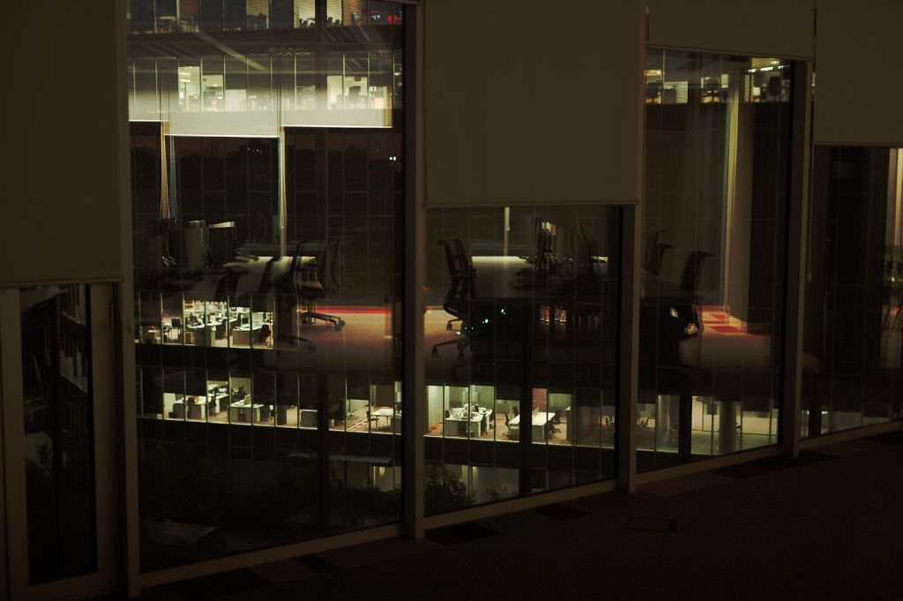
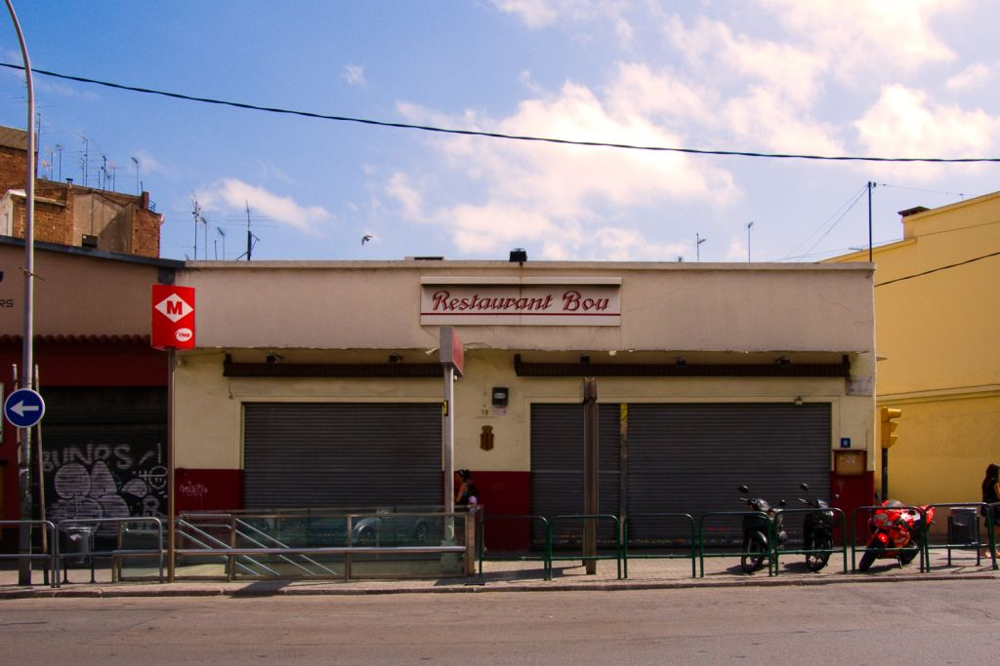
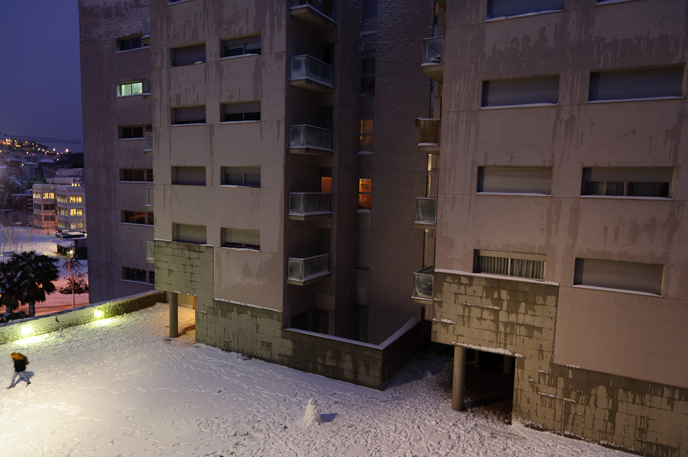
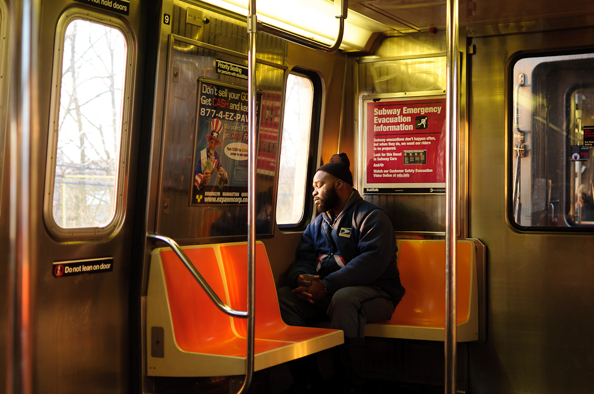
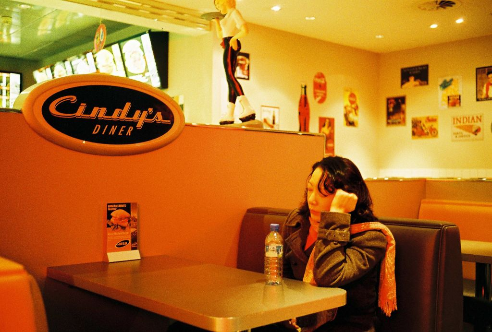
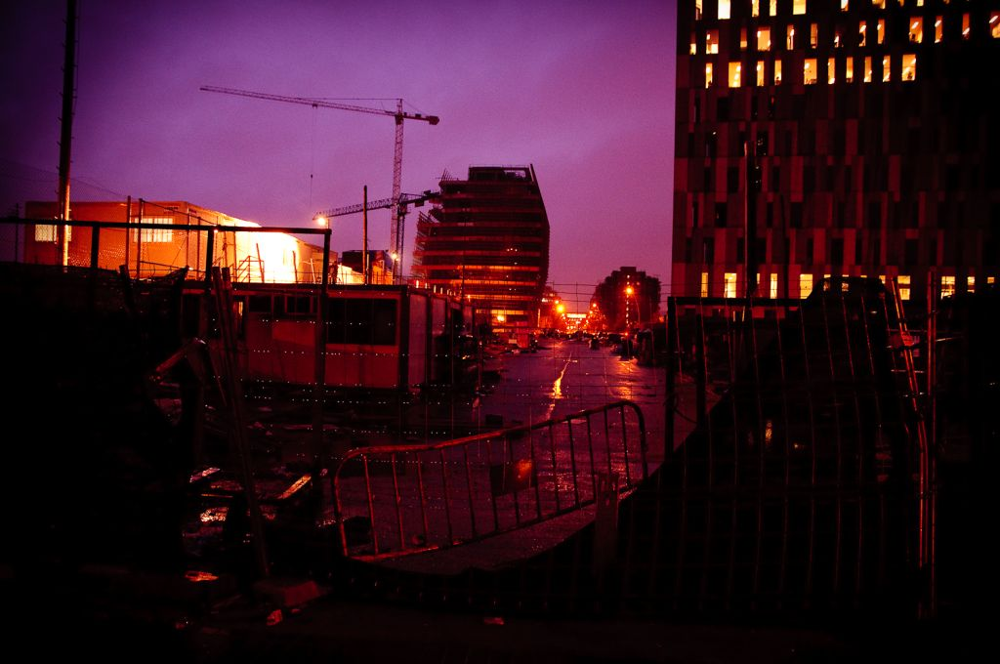
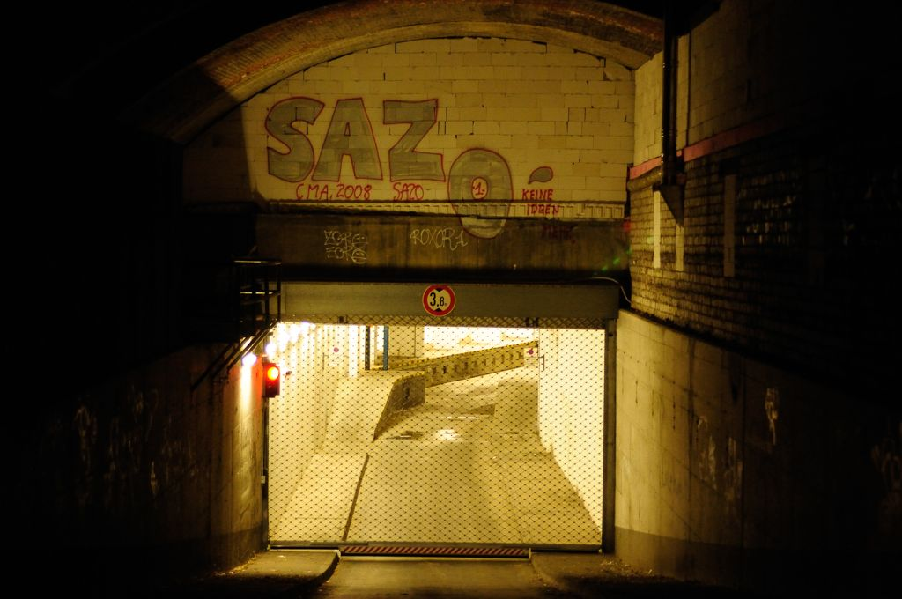

{}

<--->
Sincronizados al ritmo urbano es difícil cuestionarse. Nos arrastra como la corriente de un río que no sabemos a dónde
va. Cuando de repente somos una gota desprendida del conjunto y caemos verticalmente, sintiendo el vértigo de la cascada
adquirimos una conciencia distinta de nuestra propia naturaleza.</td>
{}

{}

<--->
Después del golpe volvemos a ser parte del todo, y, aunque solo sea por la diferencia de velocidad, podemos sentir la
quietud del estanque.</td>
{}

{}

<--->
Es el ritmo de la vida, pero hay escenas que se nos aparecen y modifican ese ritmo habitual. ¿Qué hay en esa escena que
“tiene” que ser fotografiada?</td>
{}

{}

<--->

{}

{}
Aún no son imágenes, a veces, no llegan a serlo. Son vivencias visuales. Algunas codifican todas nuestras influencias,
otras explican cómo nos sentíamos, otras son intentos de atrapar el espíritu de la luz.</td>
<--->

{}

{}
Son un misterio que encierran tensión y calma al mismo tiempo, no son instantes decisivos, son vivencias
condensadas.</td>
<--->

{}

Más tarde, algunas de ellas será decodificadas se convertirán en series o pasarán al olvido, pero lo realmente importante es esa capacidad que tienen algunas escenas de disminuir el ritmo, de impresionarme aunque no se conviertan en fotografías. Por eso hago fotografías, para vivir el proceso del misterio, se revele o no.

Originalmente publicado en el [Blog SanDisk de PHEspaña](http://www.phedigital.com/portal/es/load.php?file=blogsandisk.php&amp;post=10394).