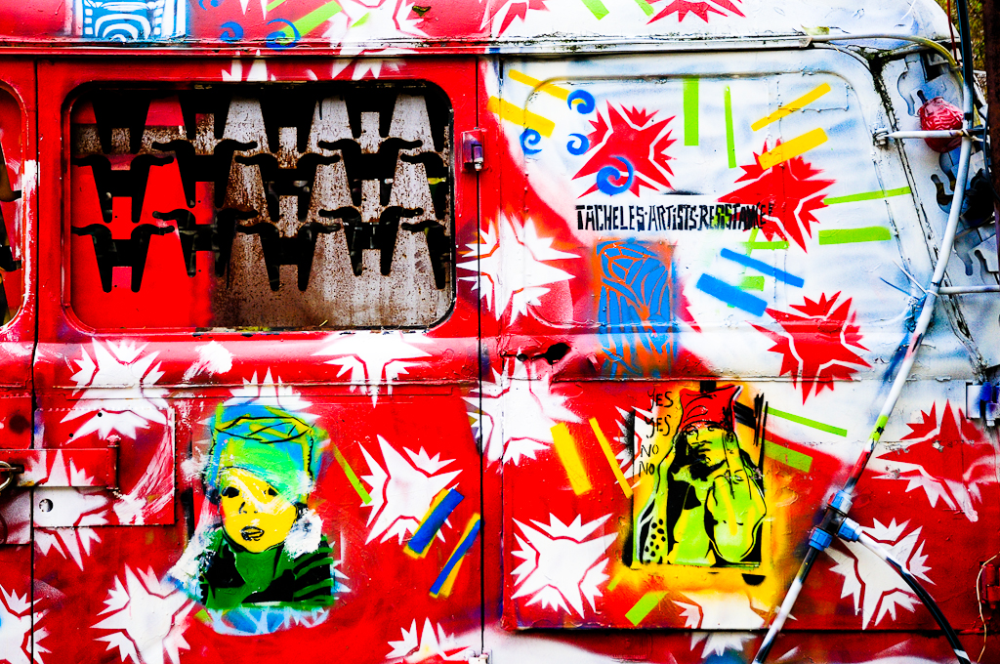
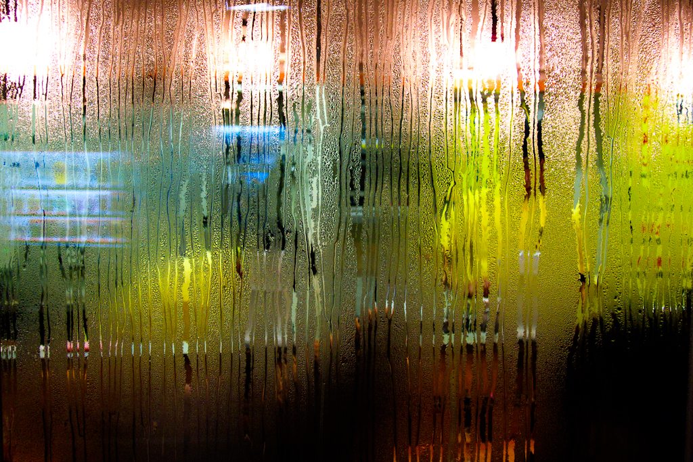
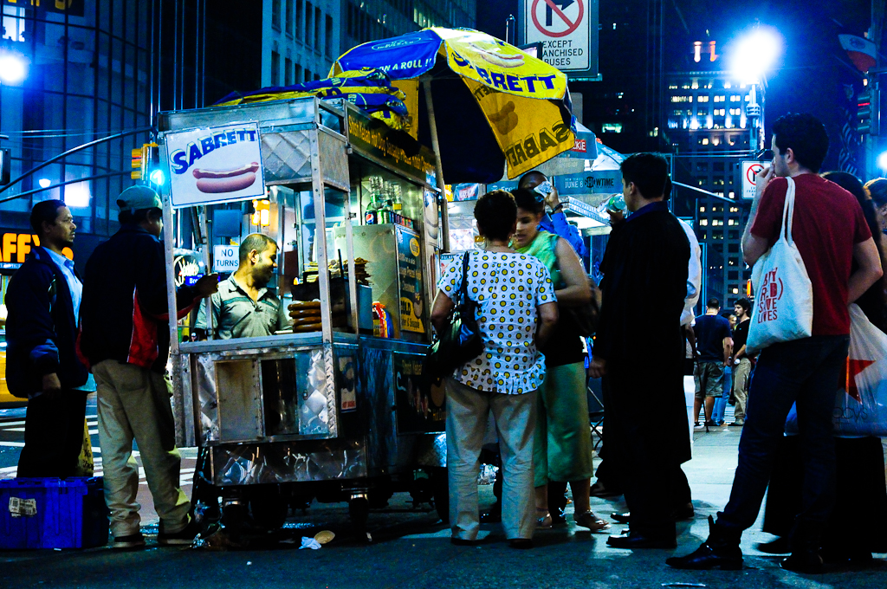

A los 6 años pedí para mi cumpleaños una bicicleta. A los 7 una cámara, fue una Kodak Brownie Fiesta. Ahora voy en moto y llevo una reflex digital. El sueño de viajar tampoco cambió. Lo curioso es que llevo toda la vida viajando con una cámara y aún no he comprendido muy bien la experiencia en su totalidad, ni emocional, ni fotográficamente.

De todas las fotos que hice entre los 7 y los 15 años recuerdo claramente 4, dos de ellas de viajes y dos del patio de casa. Este juego de rescatar imágenes de la memoria después de mucho tiempo es muy interesante. Ahora lo suelo usar para editar mis series. Después de dejarlas reposar unos meses me pregunto ¿Lisboa? La primera foto que viene a mi cabeza es Lisboa y suelo trabajar desde ese punto.

Rara vez recuerdo una imagen reconocible del lugar. Casi siempre son imágenes que nadie o muy pocos sabrían dónde han sido hechas… ¿Porqué olvido las postales y recuerdo códigos secretos?

La respuesta no tiene importancia, jugar sí.

## Berlín

{}

<--->

{}

## India

{}

<--->

{}

## Tokio

{}

<--->

{}

## Lisboa

{}

<--->

{}

## Nueva York

{}

<--->

{}

Originalmente publicado en el [Blog SanDisk de PHEspaña](http://www.phedigital.com/portal/es/load.php?file=blogsandisk.php&post=10400)
