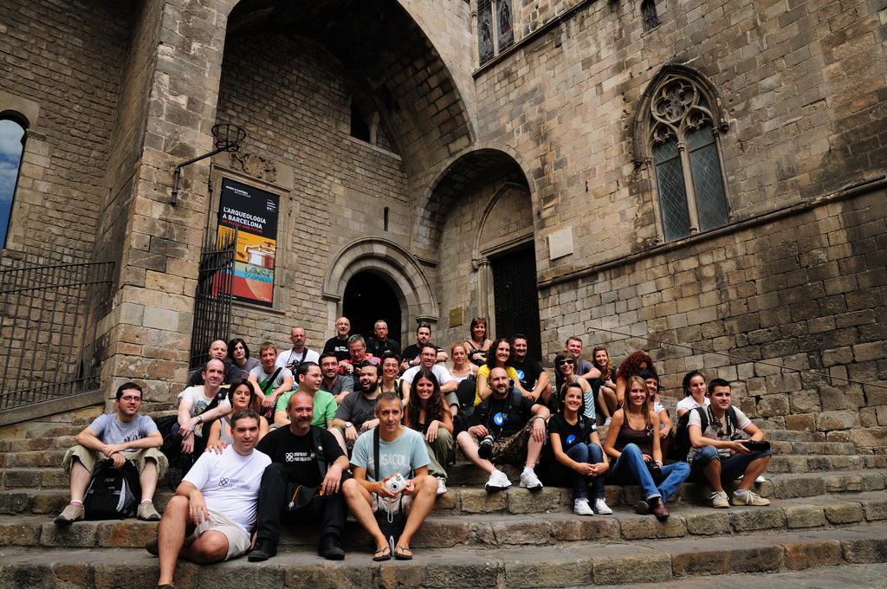
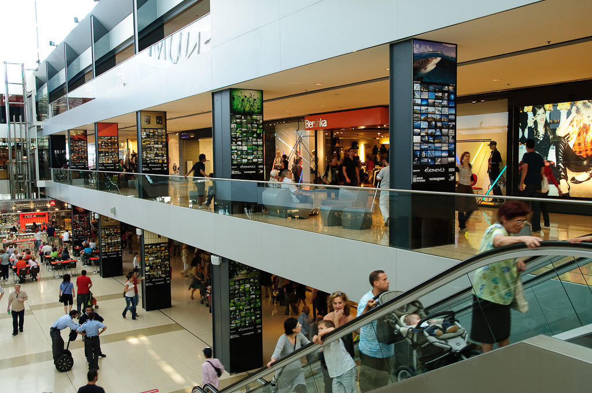

In 2002, the lab where I used to have my film developed reduced the price of ‘developing to CD’ and I started asking for the digital medium. By the beginning of 2003 I’d already decided to give paper up.

The dematerialization of my photos implied that I didn’t have anything to take to work anymore to comment on in a café. A friend recommended some software that he was using for galleries. I ended up adapting the program. I wanted the last photos to be seen first; the photos had to be of large size, taking up the whole screen, unobstructed; and I wanted viewers to be able to leave comments.

After a while, I discovered that I had set up a photoblog. And as with everything, I wasn’t the first or the best. Photoblogs were popping up everywhere in the beginning of 2000’s but I will come back to that later.  
The world “fotoblog” is the result of the ‘spanification’ of “photoblog”, a category of blog classified by media type, a sort of a morphologic classification.

According to this classification blogs can be:

-   Blogs (text-oriented)
-   Photoblogs (photography)
-   Videoblogs (videos)
-   Sketchblogs (drawings, theoretically published in specific file formats)
-   Typecast ( manuscripts)
-   Etc…

So, a photoblog is a type of blog where photographs are published. The photographs are the content; they don’t either illustrate or accompany. A photoblog can be defined as an online exhibition format for photographs designed to be updated and read periodically and characterized by being compiled in inverse chronological order to the date of publishing.

Each entry (or post) of this typology of blog contains at least one photograph that can be presented without any text or even a title. The goal of a photoblog is to show photographs.

Additionally, it must be clarified that a photoblog is not a blog where one speaks about photography or cameras; that would be semantic classification from which things like ‘cowblogs’ could surge if we were writing about cows.

## Design, layout and interaction

There are different standardized layouts, the first one being the most classical, where there’s just one photo per entry that occupies the whole screen. For example, my photoblog: [http://justpictures.es/](http://justpictures.es/).  
The second most used layout also has one image per entry but you can see various images at the same time. For example, [Silvia Varela Diary](http://www.silviavareladiary.com/).

Finally, there are two types of layouts where each entry shows a series, some in vertical and some in horizontal format. To exemplify the first type we can see Albert Jordar’s [yakuzablog](http://www.yakuzasblog.net/?p=18) and the second, horizontal type, is exemplified by [Abigail Reese](http://abigailreese.com/blog/).

For me, taking advantage of the whole screen area and getting the simplest interaction is essential. With the most classical design, the viewer has to click just once, not even having to move the mouse and, in the case of touchscreen devices, it’s even simpler: you just have to ‘touch’ the photo in order to see the next one. Having to use the scroll bars (horizontal or vertical) is a nuisance. Also, I prefer for one image to be seen on the screen; a series can be viewed by interacting.

## Books, newspapers, paintings, screens, iPad and Wii

In his presentation at SCAN’08 Quentin Bajac mentioned a study by Pompidou Center regarding the suitability of the vertical and horizontal exhibition format for photography. The study analyzed horizontality and verticality. It said that the idea of hanging photographs had been largely influenced by the concept of hanging paintings. It seemed more natural to view photographs in books or newspapers since they are more modern formats, more contemporary to photography itself…

It turns out that now we can look at photographs on the screens of computers, mobile phones, iPads and we can interact with them even through game consoles. The nexus that all of the devices have in common, from the point of view of an author who distributes content, is the web.  
Certainly, there are other platforms to distribute photography on-line, such as galleries, PDF’s, e-mails and different formats of eBooks, each one suiting best different types of communication.

The photoblogs are firstly blogs, which means that they are a periodical publication that is meant to be read regularly, where comments can be left and where the newest content has the most relevance. They seem to be most suitable for displaying projects in progress, personal diaries, news or daily work. In turn, a gallery, a PDF or an eBook are best for finished projects and portfolios.

A technological exception has to be made here: photoblogs, being blogs, are best adapted to web 2.0. Web 2.0 and social networks make updating content a priority. It could be one of the reasons why we would be interested in using a photoblog to show finished projects or portfolios – not because it’s the type of container that adjusts best to content but because it helps achieve most diffusion.

## Photoblog as a project and conceptual photoblogs

A photoblog can be a project in itself or be a medium for showing an independently conceived project.

My photoblog ‘[justPictures](http://justpictures.es/)’ fits the most classical definition of a photoblog. It’s a personal diary, it’s published every day, there’s one photograph per entry, rarely can you find text there, and the design is minimalist. As a result, it has very little glamor, no unified concept of photographic style behind it, which often makes it lack visual coherence. A casual visitor, when he sees just one photo on the home page, does not understand that there are many more behind it.

But the objective of my blog is no to reach massive audience but a limited group of viewers, many of them close ones, and, above all, to keep me working and thinking. It’s not an outlet for selling my work; I consider those published photos to be drafts.

They have passed the selection stage that happened very close to when the photos were taken and they lack perspective but a later look gives me clues to keep searching. Nonetheless, there is an infinite number of blogs that have behind them a concept, a certain style and some defined intention.

In the section “About the Author” of [Muros hablados](http://muroshablados.es/) it says: “When there’s no other place but a wall in the street to express yourself…” “That is the motif behind the photoblog, to take advantage of this medium so that words that have been written can be read.” Judging from one of the [last entries](http://muroshablados.es/archives/1919) many can think that it’s a photoblog about graffiti but it’s about a conglomerate of messages left on the walls.

Other photoblogs with a defined style or concept could be:

-   Erika Svensson: [http://erikasvensson.com/](http://erikasvensson.com/)
-   nofound, de varios autores, curado por Emeric Glayse: [http://nofound.tumblr.com/](http://nofound.tumblr.com/)
-   Oscar Ciutat: [http://oscarciutat.com/](http://oscarciutat.com/)
-   emillamola de Enric Mestres Illamola: [http://emillamola.com/](http://emillamola.com/)
-   yamasaki ko-ji: [http://www.yamasakiko-ji.com/](http://www.yamasakiko-ji.com/)
-   Nocturama fotoblog de Marcelo Aurelio: [http://www.arte-redes.com/nocturama/](http://www.arte-redes.com/nocturama/)
-   macroColors de Lia Naim, [http://macrocolors.com/](http://macrocolors.com/)
-   deletedimages, de varios autores: [http://www.deletedimages.com/](http://www.deletedimages.com/)
-   baldiri: [http://baldiri.net/](http://baldiri.net/)

A good place to look for interesting photoblogs is annual photoblog awards. The one I liked best (but which have only had three editions) is the ‘[photobloggies](http://photobloggies.org/)’. [Photoblog awards](http://www.photoblogawards.com/) continue and you can see the most voted for in 2010 here:  
[http://www.coolphotoblogs.com/awards](http://www.coolphotoblogs.com/awards) (this award is based on audience votes so it’s not as convincing to me).

## “God creates them and they join up together”

I was telling you that in the beginning of 2000’s photoblogs started popping up everywhere. At that time everything revolved around a photoblog directory, [photoblogs.org](http://photoblogs.org/). Their wiki gave basic definitions and instructions on how to start.

The directory allowed you to find photoblogs by similar themes and by the location of the photobloggers. That was the key, the location. Suddenly, we had a list of photoblogs in Spain and started following Spanish photobloggers, commenting their photos, and, little by little, a photoblogging community was born. The first physical manifestation of the on-line community took place as a meet up in Zaragoza in October of 2005. As a direct consequence, Barcelona Photobloggers was born in February of 2006, which was later followed by [Madrid Photobloggers](http://madridphotobloggers.blogspot.com/), [Vinaròs Photobloggers](http://www.vinarosphotobloggers.org/) and [Valencia Photobloggers](http://valenciafotobloggers.org/).

At the same time, at European level, [Europe Photobloggers](http://europephotobloggers.org/) was created and the tendency was repeated in many cities, such as London, New York, Toronto, Chicago, etc.

This way, what had started as a way to show photos on-line turned into a local community related to cultural activities. In my case, as a co-founder of Barcelona Photobloggers, I can assure you that reality has fully surpassed imagination.

For example, among some of the projects [we’ve done](http://barcelonaphotobloggers.org/info/#a52) are collaborations such as [Caja Azul](http://caja-azul.org/), a space for debates about photography theory, and many more that are about to see the light.

In this short review about photoblogging, I’ve omitted certain topics such as Flickr, the influence on the amateur market, esthetic trends native to the web and many other things. I’ve focused on photoblogs hosted on personal domains with personalized design because they seem more appropriate as an artistic resource but there’s much more to talk about.

In ‘Wikipedia’ photoblogging is defined as the act of periodically publishing photographs on the web, but it is much more than that, especially when it comes to interaction, connecting through the web and the desire to work on collective projects. I hope I’ve been able to give a taste of this world, a mix of the artistic and the technological, to the reader of the blog PHotoEspaña SanDisk.

Here are some images as a ‘good-bye’.
<table>
<tr valign="top">
<td>
Intercambio de fotografías, segundo cumpleaños de Barcelona Photobloggers 2007 
</td>
<td>
Encuentro Europe Photobloggers, Barcelona 2008
</td>
</tr>
</table>

‘Elements’ exhibition, 1578 photographs, Maremagnum Mall, Barcelona 2008. http://www.elements-barcelona.com/

Originally published in [SanDisk blog of PHEspaña](http://www.phedigital.com/portal/es/load.php?file=blogsandisk.php&post=10406)
