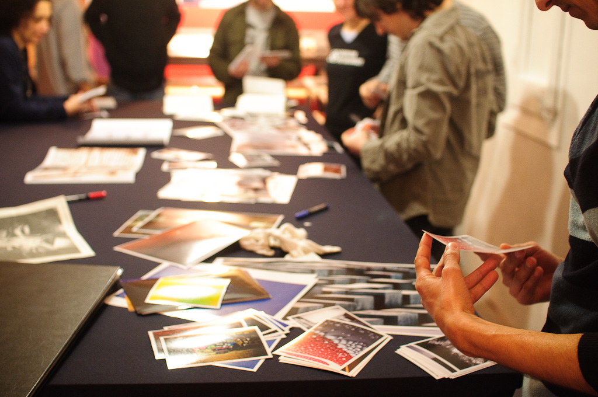
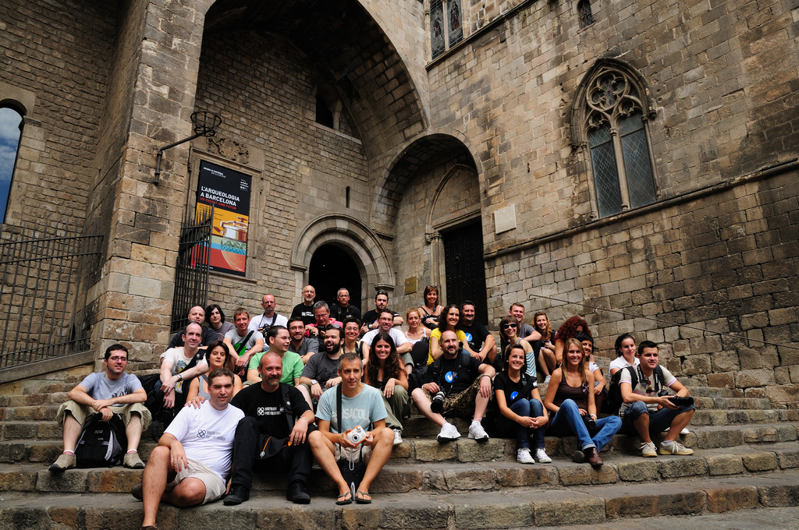

Durante el 2002 el laboratorio donde acostumbraba revelar bajó los precios del “revelado a CD” y empecé a pedir siempre el soporte digital. A principio del 2003 ya había decidido abandonar el papel.

La desmaterialización de mis fotos implicó que ya no tenía “nada” que llevar al trabajo para comentar en el café. Un compañero me sugirió un soft que estaba usando para galerías. Acabé adaptando el programa; buscaba que se vieran primero las últimas fotos que hubiese subido, que las fotos se vieran grandes, ocupando casi toda la pantalla, sin estorbos, y que se pudieran dejar comentarios.

Con el tiempo descubrí que había montado un fotoblog. Y como en todo, no era el primero, ni el que mejor lo había hecho. Los fotoblogs estaban surgiendo por todas partes a principios de “los 2000”, pero a eso volveré más tarde.

La palabra fotoblog es la castellanización de photoblog una categoría de blog según la clasificación por “media type”, algo así como una clasificación morfológica.

Según esta clasificación los blogs pueden ser

-   blogs (textuales)
-   photoblogs (fotografías)
-   videoblogs (vídeos)
-   podcast (audio)
-   sketchblogs (dibujos, teóricamente publicados con formatos de ficheros específicos)
-   typecast (manuscritos)
-   etc…

Entonces un fotoblog es un tipo de blog en que se publican fotografías. La fotografía es el contenido, no ilustra ni acompaña. Podríamos definir un fotoblog como un formato expositivo en red para fotografías, diseñado para ser actualizado y leído periódicamente y que se caracteriza por ser una recopilación ordenada cronológicamente de forma inversa a la publicación.

Cada entrada (o post) de esta tipología de blog tiene al menos una fotografía, puede prescindir de texto, incluso de título. El objetivo de un fotoblog es mostrar  
fotografías.

Por contraste debería quedar claro que un fotoblog no es un blog en el que se habla de fotografía, ni de cámaras, eso sería una clasificación semántica de la que podrían surgir cosas como los vacablogs, si escribiésemos de vacas.

## Diseño, layout e interacción

Hay varios layouts estandarizados, el primero, el más clásico, es el de una sola fotografía por entrada y que ocupa toda la pantalla. Por ejemplo, mi fotoblog, [http://justpictures.es/](http://justpictures.es/)

El segundo más utilizado sigue siendo teniendo una imagen por entrada, pero se pueden ver varias imágenes al mismo tiempo. Por ejemplo, [Silvia Varela Diary](http://www.silviavareladiary.com/)

Finalmente hay dos tipos en los que cada entrada muestra una serie, algunos en forma vertical y otros en forma horizontal. De la primera clase podríamos ver, [yakuzasblog](http://www.yakuzasblog.net/?p=18), de Albert Jordar, y de la segunda, los horizontales podríamos citar a [Abigail Reese](http://abigailreese.com/blog/).

Para mi, aprovechar toda la pantalla y conseguir la interacción más simple es esencial. En el diseño más clásico el lector solo tiene que hacer click, sin siquiera mover el ratón, en el caso de un dispositivo táctil es, aún más sencillo, solo tiene que “tocar” la foto para ver la siguiente. Tener que utilizar las barras de desplazamiento, sean horizontales o verticales, es una molestia. Además, prefiero que en la pantalla se vea una sola imagen, la serie se puede leer interactuando.

## Libros, periódicos, cuadros, pantallas, iPad y Wii

En una ponencia de Quentin Bajac en SCAN’08 mencionó un estudio del Centre Pompidou referente a la idoneidad del formato expositivo vertical u horizontal para la fotografía. El estudio analizaba la horizontalidad y verticalidad, la idea de colgar fotografías estaba muy influenciada por la idea de colgar cuadros, parecía más natural leer fotografías en libros o periódicos porque eran un formato más moderno, más contemporáneo a la fotografía misma…

Resulta que ahora podemos ver fotografías en pantallas de ordenador, teléfonos móviles, iPads y podemos interactuar con ellas incluso con las consolas de juego. El nexo común que tienen todos los dispositivos, desde el punto de vista de un autor que distribuye contenido, es la web.

Desde luego existen otros contenedores para la distribución on-line de las fotografías, como las galerías, los PDFs, los mails y los distintos formatos de eBooks y cada uno de ellos se adapta mejor a distintos tipos de comunicación.

Los fotoblogs son, antes que nada, blogs, es decir, una publicación periódica que se lee de manera regular en la que normalmente se pueden dejar comentarios y que da mayor relevancia al contenido más nuevo. Parecen una herramienta más adecuada para comunicar proyectos en desarrollo, diarios personales, noticias o trabajo diario. En cambio una galería, PDF o eBook se adapta más a proyectos terminados y portfolios.

Aquí hay que hacer una salvedad tecnológica, los fotoblogs, al ser blogs, están más adaptados a la web 2.0. La web 2.0 y las redes sociales dan mucha importancia a la renovación del contenido. Esta podría ser una razón por la cuál nos interesara utilizar un fotoblog para mostrar proyectos ya ha acabados o portfolios, no porque sea el contenedor que más se adapta al contenido, sino porque logra una mayor difusión.

## Fotoblog como proyecto y fotoblogs conceptuales

El fotoblog puede ser un proyecto en sí mismo o ser un medio para dar a conocer un proyecto concebido independientemente.

[justPictures](http://justpictures.es/), mi fotoblog, cumple con la definición más clásica de fotoblog. Es un diario personal, publica cada día, solo hay una fotografía en cada entrada, rara vez hay texto y el diseño es minimalista. Visto así, tiene muy poco glamour, no tiene un único concepto ni estilo fotográfico detrás, lo que muchas veces le quita coherencia visual. Un visitante casual, al ver solo una foto en la home, no entiende que detrás hay muchas más.

Pero el objetivo de mi fotoblog no es llegar a un publico masivo, sino a un grupo reducido de lectores, muchos cercanos, y, por encima de todo mantenerme trabajando y pensando. No es un canal para vender mi fotografía, considero que las fotografías publicadas en él son borradores.

Pasaron una etapa de selección, muy cercana a la toma y carecen de perspectiva, pero una lectura posterior me da pistas para continuar buscando. Pero existen infinitos fotoblogs que han nacido con un concepto, estilo e intención definidos.

En su “acerca de” [Muros hablados](http://muroshablados.es/) dice “Cuando no queda otro lugar que un muro o pared en la calle para expresarte…” “Éste es el motivo del photoblog, aprovechar este medio para que aquellas palabras que fueron escritas puedan ser leídas.” y como ejemplo una de las [últimas entradas](http://muroshablados.es/archives/1919) muchos podrían creer que es un fotoblog de graffitis, pero se trata de un conjunto de mensajes dejados en las paredes.

Otros fotoblogs con una definición estilística o conceptual podrían ser:

-   Erika Svensson: [http://erikasvensson.com/](http://erikasvensson.com/)
-   nofound, de varios autores, curado por Emeric Glayse: [http://nofound.tumblr.com/](http://nofound.tumblr.com/)
-   Oscar Ciutat: [http://oscarciutat.com/](http://oscarciutat.com/)
-   emillamola de Enric Mestres Illamola: [http://emillamola.com/](http://emillamola.com/)
-   yamasaki ko-ji: [http://www.yamasakiko-ji.com/](http://www.yamasakiko-ji.com/)
-   Nocturama fotoblog de Marcelo Aurelio: [http://www.arte-redes.com/nocturama/](http://www.arte-redes.com/nocturama/)
-   macroColors de Lia Naim, [http://macrocolors.com/](http://macrocolors.com/)
-   deletedimages, de varios autores: [http://www.deletedimages.com/](http://www.deletedimages.com/)
-   baldiri: [http://baldiri.net/](http://baldiri.net/)

Un buen lugar donde buscar fotoblogs interesantes son los premios anuales de fotoblogs. Los que más me gustaban solo han tenido tres ediciones son los [photobloggies](http://photobloggies.org/) . Los [photoblog awards](http://www.photoblogawards.com/) aún continúan y podéis ver a los más votados en el premio del 2010 en [http://www.coolphotoblogs.com/awards](http://www.coolphotoblogs.com/awards) (este premio se basa en votaciones populares, por eso no  
me acaba de convencer)

## “Dios los cría y ellos se juntan”

Os decía que a principios del 2000 los fotoblogs aparecían por todas partes, en esa época todo giraba en torno a un directorio de fotoblogs [photoblogs.org](http://photoblogs.org/) La wiki de photoblogs.org tenía las definiciones básicas e instrucciones para empezar.  
El directorio nos permitió encontrar fotoblogs por temáticas similares y por ubicación del fotobloguer. Esa fue la clave, la ubicación. De repente teníamos un listado de los fotoblogs de España y comenzamos a seguir a los fotobloguers españoles a comentar en las fotos y, poco a poco, fue naciendo la comunidad fotobloguer. La primera manifestación física de la comunidad on-line fue el encuentro en Zaragoza en octubre del 2005. Como consecuencia directa nace [Barcelona Photobloggers](http://barcelonaphotobloggers.org/) en febrero del 2006, a la que después se le unen [Madrid Photobloggers](http://madridphotobloggers.blogspot.com/), [Vinaròs Photobloggers](http://www.vinarosphotobloggers.org/) y [Valencia Photobloggers](http://valenciafotobloggers.org/).

Al mismo tiempo, a nivel Europeo, crece [Europe Photobloggers](http://europephotobloggers.org/) y en muchas ciudades se repite la tendencia como Londres, Nueva York, Toronto, Chicago, etc.

Así, lo que había empezado como una forma de mostrar las fotos on-line, se convierte en una comunidad local de actividades culturales. En mi caso, como co-fundador de Barcelona Photobloggers os puedo asegurar que la realidad ha superado ampliamente a la imaginación.

Me gustaría que vierais esta referencia, algunos de los proyectos que [hemos hecho](http://barcelonaphotobloggers.org/info/#a52) a los que podemos sumar colaboraciones como [Caja Azul](http://caja-azul.org/), un espacio de debate teórico de fotografía y muchas más que están por ver la luz.

En esta pequeña reseña de fotoblogueando he omitido ciertos temas como Flickr, la influencia en el mercado de los aficionados, las tendencias estéticas nativas de la web y muchas otras cosas. Me he centrado en los fotoblogs alojados en dominios propios con diseños personalizados porque me parecen más apropiados como recurso artístico, pero hay mucho más de que hablar.

En la wikipedia se define photoblogging como la acción de publicar periódicamente fotografías en la red, pero es mucho más cuando comienzan las interacciones, la conexiones de la red y las ganas de trabajar en proyectos comunes, espero haber podido dar una pequeña pincelada de este mundo, una mezcla entres artístico y tecnológico, a los lectores del Blog PHotoEspaña SanDisk.

Os dejo algunas imágenes de despedida:
<table>
<tr valign="top">
<td>
Intercambio de fotografías, segundo cumpleaños de Barcelona Photobloggers 2007 
</td>
<td>
Encuentro Europe Photobloggers, Barcelona 2008
</td>
</tr>
</table>

Exposición “elements” 1578 fotografías, centro comercial Maremagnum, Barcelona 2008 http://www.elements-barcelona.com/

Originalmente publicado en el [Blog SanDisk de PHEspaña](http://www.phedigital.com/portal/es/load.php?file=blogsandisk.php&post=10406)