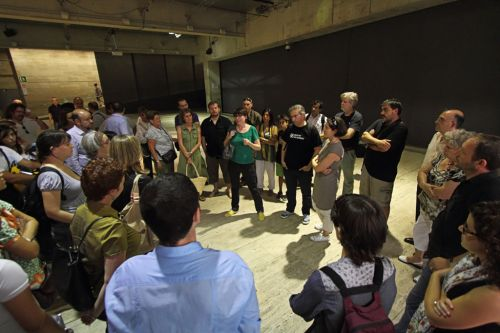
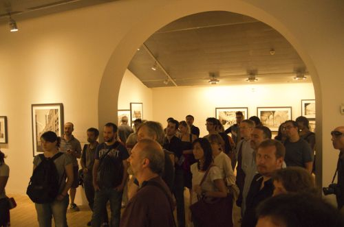

<audio class="player" controls preload="none" src="2011-06-30-cccb-bcnph-2.mp3" type="audio/mp3"></audio>

Ayer pudimos disfrutar de una visita guiada a <a href="http://barcelonaphotobloggers.org/2011/06/03/exposicio-branguli-barcelona-1909-1945/">"Brangulí. Barcelona 1909-1945"</a> por Susana García, coordinadora de la exposición en el CCCB.

La visita es una actividad del proyecto participativo <a href="http://www.brangulivaseraqui.com/" target="_blank" rel="noopener noreferrer">Brangulí va ser aquí, i tu?</a> para acercarnos a la visión de Brangulí e inspirarnos para enviar fotos.

Queríamos agradecer a todos los que nos habéis acompañado y, para los que no habéis podido venir, dejaros el audio de la charla ( [descarga](2011-06-30-cccb-bcnph-2.mp3) )

