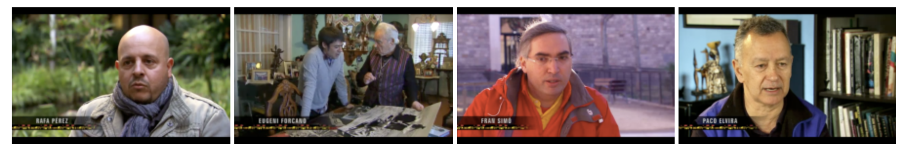

On February 24 at 21:45, Fotografies program on ‘channel 33’ showed a special on street photography for which I had the luck of getting interviewed. My adventure companions were incredible: [Eugeni Forcano](http://www.eugeniforcano.info/), [Paco Elvira](http://pacoelvirafoto.blogspot.com.es/) and [Rafa Perez](http://elfotografoviajero.com/).

The 25 minute program can be seen here: [http://www.ccma.cat/tv3/alacarta/fotografies/street-photography/video/3966610/](http://www.ccma.cat/tv3/alacarta/fotografies/street-photography/video/3966610/)

Some of my photographs can be viewed on Catalunya Television’s website in this [online gallery](http://www.ccma.cat/tv3/Galeria-Fran-Simo/foto-galeria/19654/).

I recommend you check out [Paco’s blog entry](http://pacoelvirafoto.blogspot.com.es/2012/02/la-street-photography-en-el-programa.html).