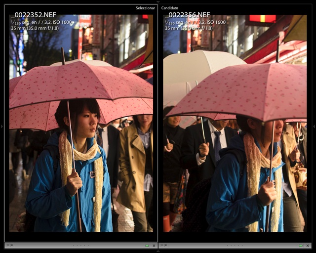

Hace unas semanas, seleccionando fotos para el fotoblog, me encontré con esta pareja de imágenes. Me pareció interesante hacer una serie de entradas con las dudas que tengo durante los procesos de edición. Aunque al final dejo alguna certeza, la mayoría son interrogantes.

Había empezado a seleccionar buscando un conjunto de street photography y al ver estas fotos se disparó la eterna cuestión ¿qué es <em>street photography</em>?

La definición general que más me gusta es la de <a href="http://www.lfph.org/what-is-street-photography" target="_blank" rel="noopener noreferrer">London Festival of Photography</a> <em>“un-posed, un-staged photography which captures, explores or questions contemporary society and the relationships between individuals and their surroundings.”</em>

Pero la cosa no acaba ahí, porque surge la pregunta ¿qué no es street? es casi más importante que la primera. Y para aclarar esto me gusta la frase de <a href="http://www.in-public.com/information/what_is" target="_blank" rel="noopener noreferrer">Nick Turpin</a> <em>“It is a simple ‘Zen’-like experience…”</em>

Ambas partes coinciden de lleno con las ideas de Rafa Badía, el aspecto documental y el lúdico. Los dos ejes principales que se tienen que traducir en el tercero: el estético.

En estas fotografías, tomadas con segundos de diferencia, la experiencia es la misma, pero no sirven de la misma forma al aspecto documental y por supuesto no tienen la misma carga estética. Es en el supuesto documentalismo relacionado a la <em>street photography</em> donde están mis principales problemas filosóficos, que abordó desde una perspectiva personal, en lo que podríamos llamar el “camino del autor”.

Empecé a hacer <em>street photography</em> por una necesidad irracional e inexplicable, como empiezo casi todos mis trabajos. Pero el tiempo ha agregado una convicción: “nuestro tiempo y lugar deben ser retratados”. Esta certeza nació frente las fotos de Joan Colom. Entre sus fotos y mis ojos había un contraste. En esa época fotografiaba mucho el Raval. El vínculo “mi lugar” versus “otro tiempo” es la clave para comprender la importancia de la <em>street photography</em>. Entendí que la práctica sistemática del género es un legado que trasciende al autor y al sujeto. El autor solamente es útil como mensajero.

El legado de Colom, Winogrand, Evans, Maier y tantos otros trascienden su esteticismo y nos transportan a otro tiempo, a mundos que han desaparecido. No me emociono por la composición, el estilo o la coherencia sino por cómo funcionan como ventanas al pasado, por su capacidad de contar una historia.

Me llama la atención la ropa, las tipografías de los periódicos y sus titulares, los coches. La tetera del bar, que de ser París podría seguir siendo casi la misma, pero si la foto es de Nueva York seguramente hoy sería completamente diferente.

Muchas veces hago un ejercicio ¿qué cuenta mi foto de este tiempo? Envejecerán como las de Colom. ¿Dentro de 50 años la <a href="http://passengers-streetphotography.com/" target="_blank" rel="noopener noreferrer">serie de libros Passengers</a> tendrán el peso que hoy tienen los de Evans, Baudrillard, Agou o Davidson?

Si una foto puede responder a estas preguntas empieza a parecerse a la <em>street</em> que quiero conseguir. No disparo street para consumirla hoy, sino para que sea consumida dentro de varias generaciones.

Hasta aquí el primer eje y el primero post. Seguiré con el aspecto lúdico/zen en el siguiente, y si tengo valor, tal vez, me atreva con un tercero de estética (siempre desde mi visión personal).

¿Qué foto elegí? Por ahora las dos. La de la derecha entra mejor dentro de mi serie <a href="http://justpictures.es/tags/street-portraits/" target="_blank" rel="noopener noreferrer">street portraits</a> y la otra era más comercial para el consumo en redes sociales y fue <a href="http://justpictures.es/photo/10367/3334/" target="_blank" rel="noopener noreferrer">publicada en el fotoblog</a>. Normalmente edito en saltos de tiempos. Hago una primera selección durante o inmediatamente al llegar del viaje. Una segunda un año después. Y otra, la definitiva, en algún momento posterior. Este par fueron el rompedero de cabeza en la segunda vuelta.

PD: sí el título es un guiño a la serie “Cosmos: un viaje personal” de Carl Sagan, especialmente al primer capítulo “En la orilla del océano cósmico”.