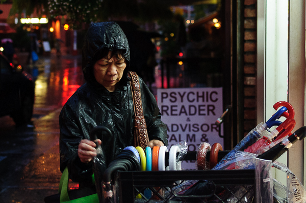
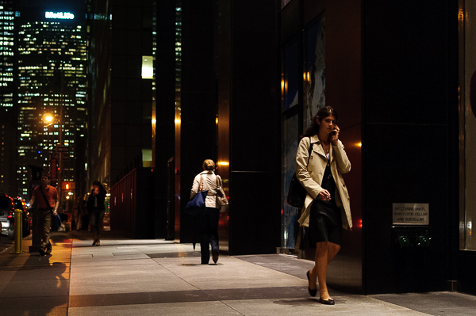
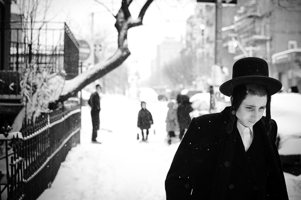
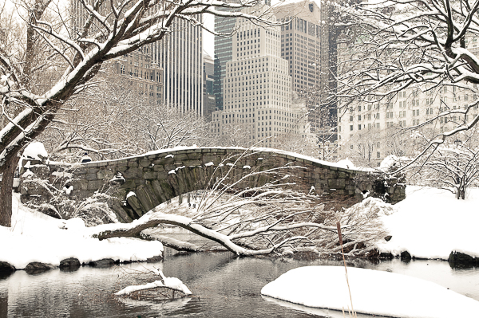
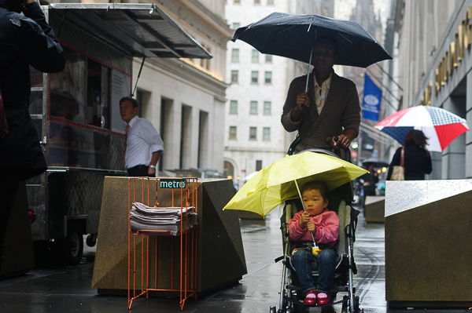
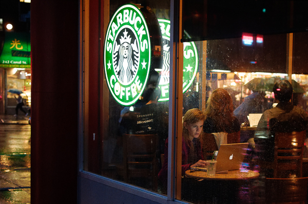
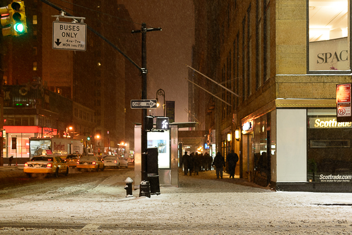

Hace tiempo que tenía ganas de contar una forma de trabajo que estoy explorando. Normalmente edito fotos con un sistema secuencial de varias pasadas. En el caso de mis propias fotos intento dejar mucho tiempo entre una pasada, meses o años.

El ciclo normal es hacer un visionado de todo el material inmediatamente después de la captura y dejarlo reposar un año para hacer la segunda pasada (a todo el material). De la combinación sale el “borrador” de mi trabajo, que voy colgando en mi [photoblog](http://justpictures.es/). En esta etapa ya nomino algunas fotografías como “[my-favs](http://justpictures.es/album/my-favs/)“, que son las que veo cuando me piden algún tema. Para hacer algo que considere meditado lo dejo aún más tiempo.

Lo que estoy experimentando desde hace un tiempo es la “edición de memoria”. Se trata de proponer un tema y ver qué fotos soy capaz de recordar sin ayuda del archivo, ni de la clasificación anterior.

Las fotos de abajo son las que recordé al pensar “New York, New York”. El tema lo escogí porque es el siguiente grupo de fotografías que tengo que preparar para el photoblog.

Es un juego divertido. Por ejemplo la primera que vino a mi mente tiene una leyenda curiosa: “PSYCHIC READER”.  

La segunda es una referencia a otro autor. Tengo que admitirlo, soy un desastre recordando nombres. Cuando vi la escena recordé una foto muy similar (Winogrand, Friedlander?). La original estaba hecha de día, en blanco y negro. En el fondo se veía el mismo edificio. Lo que me animó a quedarme en el lugar “cazando” fue el letrero. En la original el edificio aún era el de Pan American.  

Es curioso que esta foto haya sido la sexta que he recordado. Para mi esta imagen es la clave de lo que quiero conseguir cuando fotografió una ciudad. Para no extenderme [la explicación está en mi blog](http://fransimo.info/blog/2011/03/31/my-very-special-photo-new-york-essence/).  

En septimo lugar apareció una de mis fotos favoritas de todos los tiempos. Tiene un guiño informático, detrás de la chica que usa un Mac hay un chico con una camiseta de Microsoft.  

Y posiblemente la más curiosa es la última. Esta pertenece al viaje que estoy editando ahora, pero no tengo ni idea porqué la pude haber recordado.  

¿Son estas mis mejores fotos de Nueva York, las que soy capaz de recordar solo por poner la sentencia “new York, New York” en mi cabeza? No lo sé. Estoy seguro que la del perrito aparece en la lista porque hace unas semanas hablamos de fotos de perros con un amigo y que la del puente está aquí porque en la mudanza me reencontré con un libro donde apreció publicada.

¿Recordaría la mismas fotos si la intención de la selección fuera diferente? Sí, recordé estas fotos con la sentencia NYC, pero el objetivo era escribir esta entrada. Posiblemente el contexto me haya llevado a la de Met Life…

Otro sistema que suelo usar es el abrir una carpeta al azar y picar [cualquier foto](http://thefoolonthehill.fransimo.info/tag/reencuentros/) a ver qué sale. Este sistema definitivamente es solo por diversión, el de la memoria es algo que seguiré trabajando.

Espero que os haya parecido interesante.