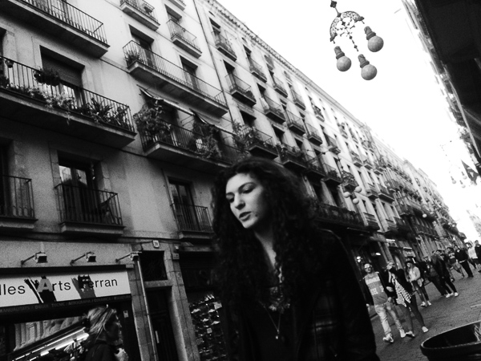
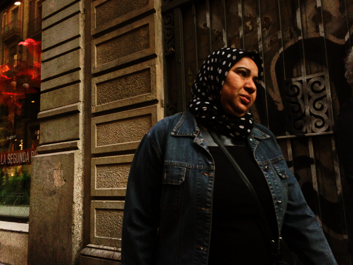
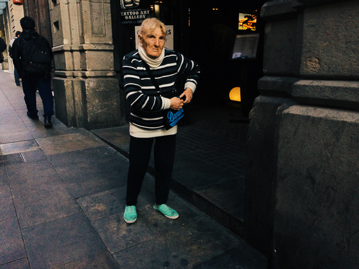
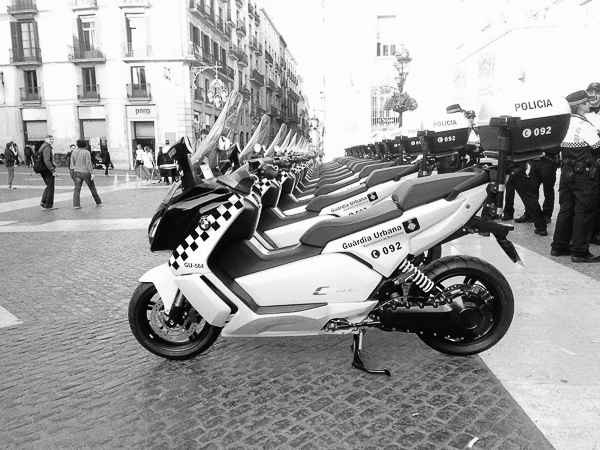
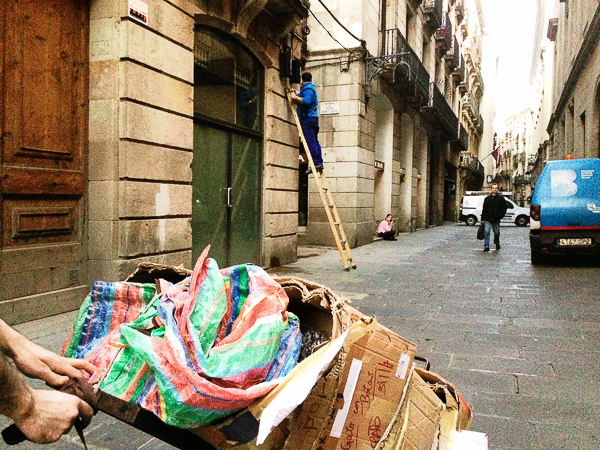
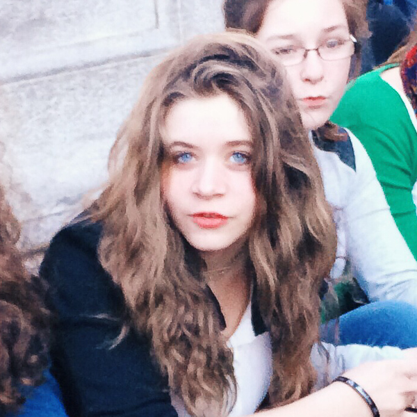
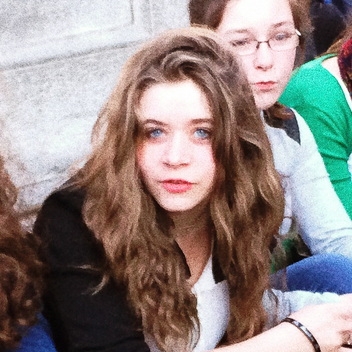

Una cámara es un conjunto de capacidades y limitaciones. La capacidad más destacable de los smartphones es que son “invisibles” y siempre están con nosotros. Para la mayoría de la gente el hecho de que todo sea automático también es una ventaja, pero para la fotografía de calle es una limitación.

Los primeros iPhones tenían el foco fijo a la [hiperfocal](http://es.wikipedia.org/wiki/Distancia_hiperfocal). A partir de la versión 4 introdujeron el autofoco, que se vendía como un avance, pero que complica la toma. Esperar a que el teléfono fuera capaz de enfocar suele significar perder la foto.

El otro gran problema para la calle es la medición automática. Un cambio de encuadre supone un cambio de los parámetros de exposición y el sistema de cálculo no es tan avanzado como el de las reflex que muchas veces sabe sortear situaciones complejas con [la medición matricial](http://en.wikipedia.org/wiki/Metering_mode#Multi-zone_metering).

Hace unos meses [Marcelo Aurelio](http://www.marceloaurelio.com/) me comentó que estaba probando una aplicación de cámara que le permitía exponer en modo manual. Se trata de [Manual](http://shootmanual.co/?utm_source=fransimo "Manual"). Permite el control manual del ISO, velocidad, foco y balance de blancos. Aunque no es la única aplicación que permite el control de foco manual, para mi es la más cercana a un fotógrafo, sobre todo porque la interfaz es limpia y fácil de usar en el momento que estás disparando. El control del foco por las aplicaciones es una mejora de iOS 8.

Pudiendo controlar la exposición y el foco las primeras limitaciones desaparecen. Decidí hacer un experimento y compartir la receta y los resultados.

Configuración de cámara:

-   Modo manual completo: foco, exposición y balance de blancos.
-   Foco: a unos 5 metros.
-   Balance de blancos: sol (emulando las diapos)
-   ISO: 200.
-   Velocidad: 1/500 o menos a ser posible.

Al caminar solo modificar la velocidad si percibimos que la luz cambia mucho. En caso extremo modificar la ISO.

Al final de la entrada encontraréis un link para descargar todas las pruebas a resolución completa para poder evaluar vosotros mismos. Estos son unos ejemplos, sin recortar, pero post-procesados.

Un problema que encontré mientras caminaba fue que al disparar con el botón del volumen en algún momento tocaba la pantalla y la aplicación cambiaba algún parámetro. Para sortearlo utilicé un disparador a distancia: [Shuttr](http://www.amazon.es/gp/product/B00JK5OW8C?ie=UTF8&camp=3714&creative=25246&creativeASIN=B00JK5OW8C&linkCode=shr&tag=justpictures-21&=wireless&qid=1426419441&sr=1-1&keywords=Muku+Shuttr). Este modelo es un poco caro pero a consecuencia de los palos selfies ya hay [modelos chinos por mucho menos](http://www.amazon.es/gp/product/5891092824?ie=UTF8&camp=3714&creative=25246&creativeASIN=5891092824&linkCode=shr&tag=justpictures-21&qid=1426419298&sr=8-6&keywords=shutter+iphone). También se pueden usar los cascos con el control de volumen, pero el cable llama la atención.

Con la aplicación Manual resolvemos la captura, pero algo querremos hacer con estas fotografías después. Una de las capacidades del iPhone es que no es solo una cámara de captura, también podemos hacer el post-procesado, incluso imprimir las fotos.

La mayoría de las imágenes de arriba están procesadas con la aplicación [VSCOCam](http://vsco.co/vscocam?utm_source=fransimo) en el mismo móvil. Las últimas dos en el ordenador con la suite [DXO](http://www.dxo.com/?utm_source=fransimo).

8 megapixels se pueden imprimir a 30x40cm (200 dpis) pero el detalle de la imagen se pierde bastante al subir la ISO, y se empieza a ver “[JPG Artifcat](http://es.wikipedia.org/wiki/Artefacto_de_compresi%C3%B3n)“. Tanto el ruido como el error de compresión se puede ocultar utilizando una máscara de grano. Por eso os dejo los ejemplos las imágenes procesadas con el DXO Film que permite copiar el patrón de grano de distintos carretes.

El efecto es bastante visible en la mejilla izquierda, los labios y el mentón pero es reconocible en todo el contorno de la cara.

Original iPhone  

Procesada VSCO  

Procesada DXO  

Para ser riguroso imprimí en casa un par de ejemplos a tamaño A4. No fui capaz de ver el detalle que se ve ampliando al 100% en el ordenador.

Para mi la fotografía de calle es ante todo una experiencia, una mezcla de danza al ritmo de la ciudad y los clicks de la cámara. Me cuesta pensar que utilice un iPhone como cámara de calle principal, pero ahora que los problemas técnicos que me lo impedían están resueltos he ganado una opción.

Los ficheros en alta resolución los podéis descargar de aquí:  [StreetPhotography\_with\_iPhone\_fransimo.zip](http://entregas.fransimo.info/calle35/StreetPhotography_with_iPhone_fransimo.zip "Ejemplos Street con iPhone").

Nota para usuarios Android: la aplicación [Manual Camera](https://play.google.com/store/apps/details?id=pl.vipek.camera2&hl=en) debería ser igual que Manual para iOs pero no he podido probarla en mis dispositivos (Moto G y Nexus 7) porque las funciones manuales aparecían como incompatibles.