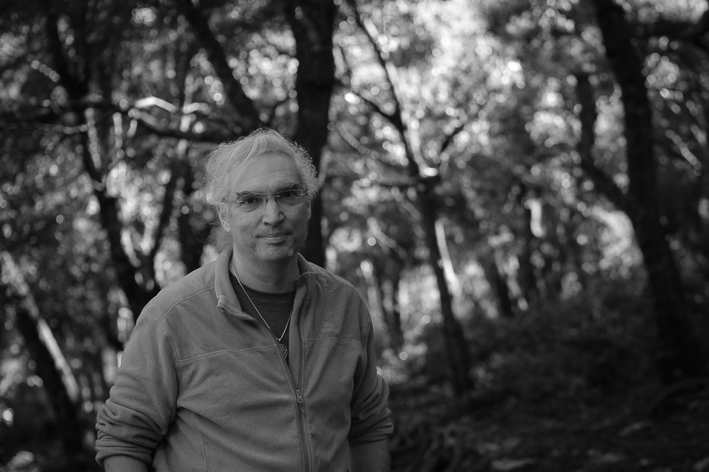

Pau Lluc fue un seudónimo que utilicé entre 2023 y 2024 para _explorar el desapego, mantener la privacidad on-line y no
condicionar la experiencia del masaje con mi identidad digital._

No quería que un cliente de masaje me relacionara con mi trabajo en inteligencia artificial. Aún no he comprendido por
qué. Lo que sé es que en este momento mi objetivo es integrar el arte, la sanación y la informatica y uno de los pasos es
integrar las identidades digitales.

## Sobre Pau Lluc

El nombre combina dos [topónimos](https://dle.rae.es/top%C3%B3nimo). El nombre de la ciudad donde nací contiene la
palabra paz.  Muchas de mis caminatas tienen como destino o lugar de
paso [Lluc](https://es.wikipedia.org/wiki/Monasterio_de_Santa_Mar%C3%ADa_(Lluch)), donde he vivido muchos momentos importantes.

**El nombre tiene como intención traer la esencia de _"paz del [bosque sagrado](https://es.wikipedia.org/wiki/Lucus_(bosque))"_.** Un lugar donde encontrarse a uno mismo
y poder ver el mundo desde una perspectiva diferente para volver a él y actuar desde un centro y una certeza basados en el amor. Ni
el camino de ida, ni el de vuelta tienen por qué ser tranquilos.

