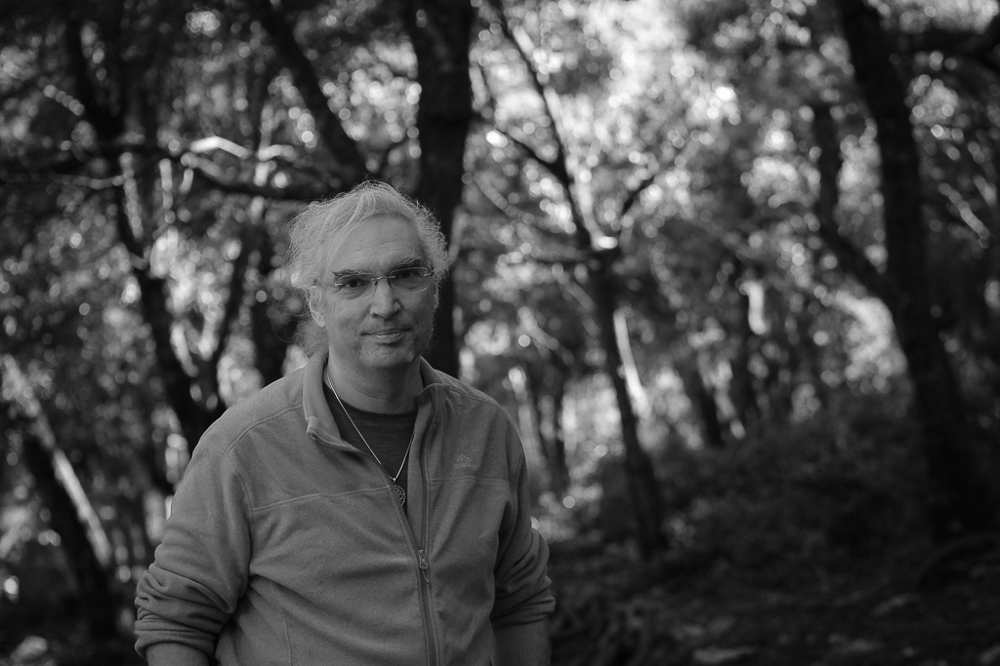

## ¿Quién soy?

Mi nombre es Fran, Pau Lluc es un seudónimo. Si has participado en actividades en Mallorca o en Catalunya posiblemente
ya nos hemos cruzado.

En los textos puedes encontrar mi [visión del masaje](/post/el_masaje/), [formación](/post/formacion/) y
los [servicios que ofrezco](/servicios/).

Nací en Argentina, por 1973. Llegué a Barcelona en 1998 y a Mallorca en 2014. Mi familia es originaria de la isla con un toque lituano.

## Sobre Pau Lluc

El nombre combina dos [topónimos](https://dle.rae.es/top%C3%B3nimo). El nombre de la ciudad donde nací contiene la  palabra paz.
Muchas de mis caminatas tienen como destino o lugar de paso [Lluc](https://es.wikipedia.org/wiki/Monasterio_de_Santa_Mar%C3%ADa_(Lluch)), donde he vivido muchos momentos importantes.

**El nombre tiene como intención traer la esencia de _"paz del [bosque sagrado](https://es.wikipedia.org/wiki/Lucus_(bosque))"_.** Un lugar donde encontrarse a uno mismo y poder ver
el mundo desde una perspectiva diferente para volver a él y actuar desde un centro y una certeza basados en el amor. Ni el
camino de ida, ni el de vuelta tienen por qué ser tranquilos.

Pau Lluc es un seudónimo para explorar el desapego, mantener la privacidad on-line y no condicionar la experiencia del
masaje con mi identidad digital. Puedo compartir mi nombre en privado y responder cualquier pregunta.
